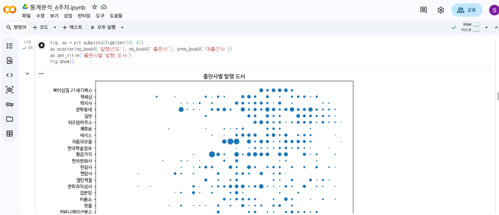
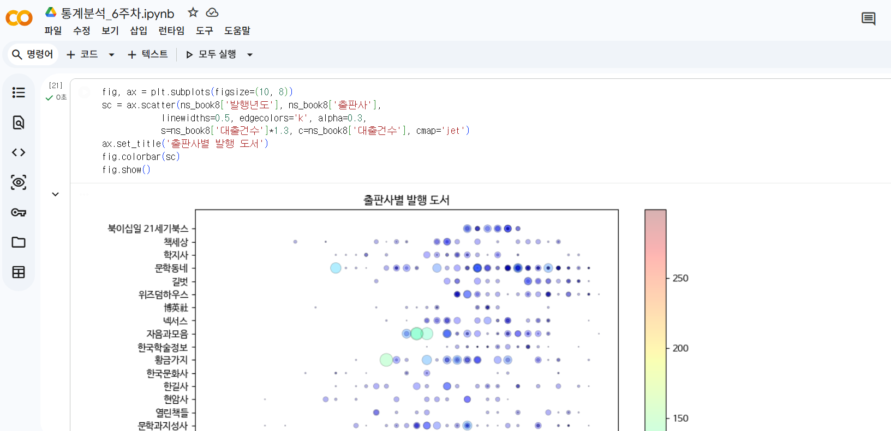
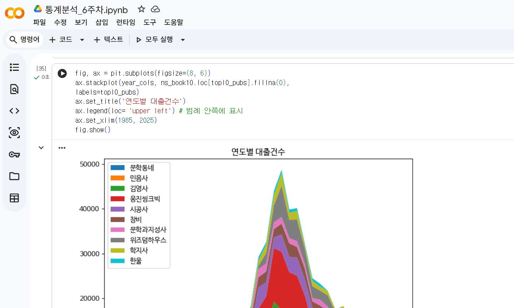
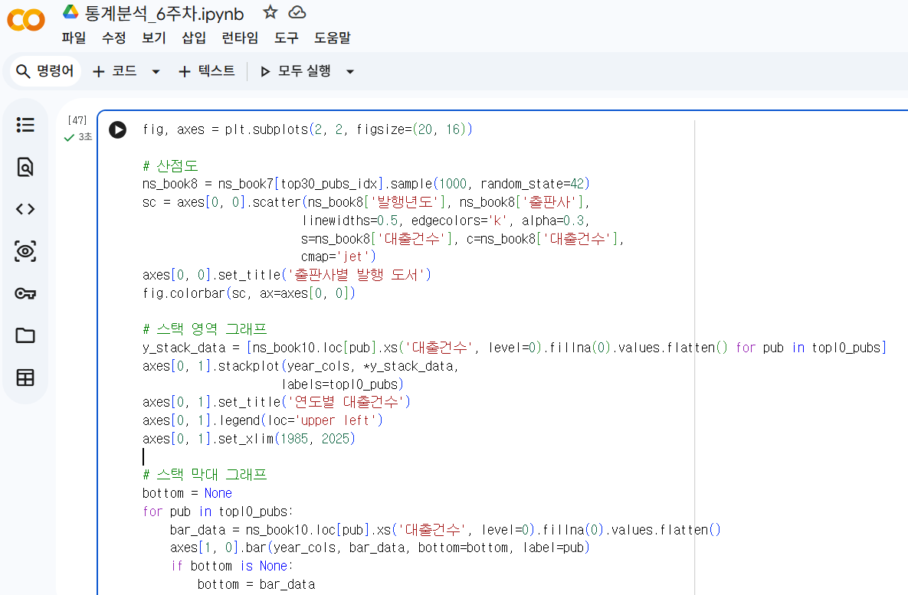
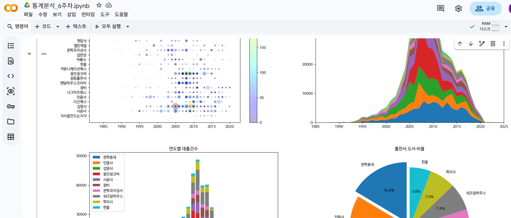

# 데이터분석 6주차 정규과제

📌데이터분석 정규과제는 매주 정해진 분량의 『*혼자 공부하는 데이터 분석 with 파이썬*』 을 읽고 학습하는 것입니다. 이번 주는 아래의 **DataAnalysis_6th_TIL**에 나열된 분량을 읽고 공부하시면 됩니다.

아래의 문제를 풀어보며 학습 내용을 점검하세요. 문제를 해결하는 과정에서 개념을 스스로 정리하고, 필요한 경우 제시된 강의를 참고하여 보완하는 것이 좋습니다.

<!-- 강의 링크는 아래와 같습니다.
https://www.youtube.com/watch?v=XD65UhBMOiI&list=PLVsNizTWUw7FGzSRCkQrPEEe-ljVXgS7k&index=12
https://www.youtube.com/watch?v=NTQ5NXelOfw&list=PLVsNizTWUw7FGzSRCkQrPEEe-ljVXgS7k&index=13
-->


## DataAnalysis_6th_TIL

### 6장 복잡한 데이터 표현하기
#### 01. 객체지향 API로 그래프 꾸미기
#### 02. 맷플롯립의 고급 기능 배우기


## Study Schedule

| 주차  | 공부 범위     | 완료 여부 |
| ----- | ------------- | --------- |
| 1주차 | p.24~81    | ✅         |
| 2주차 | p.84~151   | ✅         |
| 3주차 | p.154~219  | ✅         |
| 4주차 | p.222~279 | ✅         |
| 5주차 | p.282~325 | ✅         |
| 6주차 | p.328~379 | ✅         |
| 7주차 | p.382~430 | 🍽️         |

<br>

<!-- 여기까진 그대로 둬 주세요-->


# 1️⃣ 개념 정리 

## 01. 객체지향 API로 그래프 꾸미기

**01) pyplot vs API**

1) pyplot 방식: matplotlib.pyplot 함수 사용

2) 객체지향 API 방식: 피겨 객체와 서브플롯 객체를 만들과 이 객체의 메서드 사용
```python
# pyplot 방식
plt.plot([l, 4, 9, 16]) 
plt.title('simple line graph') 
plt.show()

# 객체지향 API 방식
fig, ax = plt.subplots() # 하나의 Axes 객체를 가지는 피겨 생성 
ax.plot([1, 4, 9, 16]) 
ax.set_title('simple line graph') 
fig.show()
```

3) 그래프에 한글 출력

방법: 폰트 설치 >> 맷플롯립 다시 임포트 >> DPI 기본값 변경

- 폰트 지정하기
    - font.family: 기본 폰트는 'sans-serif'. 이걸 = 'NaNumGothic'으로 설정
    - rc() 함수: 첫 번째 매개변수는 설정할 그룹. 두 번째 매개변수는 그룹 하위 속성. 
```python
# 노트북이 코랩에서 실행 중인지 체크
import sys
if 'google.colab' in sys.modules:
  !echo "debconf debconf/frontend select Noninteractive" | sudo debconf-set-selections
  # 나눔 폰트를 설치합니다.
  !sudo apt-get -qq -y install fonts-nanum
  import matplotlib.font_manager as fm
  font_files = fm.findSystemFonts(fontpaths=['/usr/share/fonts/truetype/nanum'])
  for fpath in font_files:
      fm.fontManager.addfont(fpath)

# 다시 설정
import matplotlib.pyplot as pit
pit.rcParams['figure.dpi'] = 100

# 글자 설정
pit.rcParams['font.family'] = 'NaNumGothic'

# 위와 동일하지만 이번에는 나눔바른고딕 폰트로 설정
pit.rc('font', family='NanumBarunGothic')

# 사이즈도 설정 가능
pit.rc('font', family='NanumBarunGothic', size=11)
```

**02) 출판사별 발행 도서 개수 산점도**

1) 고유한 출판사 목록 만들기
- value_counts() 매서드 사용 >> top30 출판사 거르기
- isin() 매서드로 출판사에 해당하는지 불리언으로 확인
- sum()으로 top30 출판사 데이터가 얼마나 되는지 확인 >> 5만 개 이상
- sample() 매서드 사용해서 천 개만 추출

2) scatter로 산점도 그리기
- 객체 지향 API 사용
```python
fig, ax = pit.subplots(figsize=(10, 8))
ax.scatter(ns_book8['발행년도'], ns_book8['출판사']) 
ax.set_title('출판사별 발행 도서')
fig.show()
```
3) 값에 따라 마커 크기 다르게
- s 매개변수 >> '대출건수'로 마커 크기 지정
```python
fig, ax = pit.subplots(figsize=(10, 8))
ax.scatter(ns_book8['발행년도'], ns_book8['출판사'], s=ns_book8['대출건수'])
ax.set_title('출판사별 발행 도서')
fig.show()
```
4) 마커 꾸미기
- alpha: 투명도 조절
- edgecolor: 마커 테두리 색
- linewidths: 마커 테두리 선 두께
- C: 산점도 색
```python
# 색 수정
fig, ax = plt.subplots(figsize=(10, 8))
ax. scatter(ns_book8['발행년도'], ns_book8['출판사'],
            linewidths=0.5, edgecolors='k', alpha=0.3,
            s=ns_book8['대출건수']*2, c=ns_book8['대출건수'])
ax.set_title('출판사별 발행 도서') 
fig.show()
```

5) 값에 따라 색상 표현: 컬러맵
- 기본값: viridis
- jet 컬러맵: 낮을수록 짙은 파란색. 높을수록 노란색 갔다가 붉은색 됨
- cmap 매개변수 사용
- colorbar() 매서드로 색상이 무엇을 의미하는지 표현 가능
```python
fig, ax = plt.subplots(figsize=(10, 8))
sc = ax.scatter(ns_book8['발행년도'], ns_book8['출판사'],
            linewidths=0.5, edgecolors='k', alpha=0.3,
            s=ns_book8['대출건수']*1.3, c=ns_book8['대출건수'], cmap='jet')
ax.set_title('출판사별 발행 도서')
fig.colorbar(sc)
fig.show()
```

### 📌 한바닥 정리

1) 객체지향 API
- 피겨와 서브플롯을 만들고 이 객체의 매서드를 사용해서 맷플롯립 그래프 그리는 방법

2) 컬러맵
- 그래프를 그리는데 사용하기 위해 사전에 정의한 색상 리스트
- 기본: viridis (진녹색 >> 노란색)
- 많이 사용: jet (파란색 >> 노란색 >> 빨간색)

3) 컬러막대
- 데이터 포인트에 적용된 색상 범위
- 그래프 오른쪽에 나란히 놓임

4) 핵심 함수 & 메서드

| 함수/메서드 | 기능 |
| --- | --- |
| matplotlib.pyplot.rc() | rcParams 객체 값 설정 |
| Figure.colorbar() | 그래프에 컬러 막대 추가 |


## 02. 맷플롯립의 고급 기능 배우기

**01) 하나의 피겨에 여러 개의 선 그리기**

1) plot() 함수 여러 번 호출
2) 선 그래프 2개 그리기
- 출판사 별로 각각 데이터 프레임 만들기
- plot() 함수 두 번 호출
```python
linel = ns_book9[ns_book9['출판사'] == '황금가지']
line2 = ns_book9[ns_book9['출판사'] == '비룡소']

fig, ax = pit.subplots(figsize=(8, 6))
ax.plot(linel['발행년도'], linel['대출건수'])
ax.plot(line2['발행년도'], line2['대출건수']) 
ax.set_title('연도별 대출건수')
fig.show()
```
- legend() 매서드: 범례 추가 (이전에 각 선 그래프에 label을 추가해야 함)
```python
fig, ax = pit.subplots(figsize=(8, 6))
ax.plot(linel['발행년도'], linel['대출건수'], label='황금가지')
ax.plot(line2['발행년도'], line2['대출건수'], label='비룡소') 
ax.set_title('연도별 대출건수')
ax.legend()
fig.show()
```
3) 선 그래프 5개 그리기
```python
fig, ax = pit.subplots(figsize=(8, 6))
for pub in top30_pubs. index[:5]:
  line = ns_book9[ns_book9['출판사'] == pub] 
  ax.plot(line['발행년도'], line['대출건수'], label=pub) # 5개 출판사 선 그래프
ax.set_title('연도별 대출건수') 
ax.legend() 
ax.set_xlim(1985, 2025) # 1990년대 이후 데이터가 중점적으로 보이도록. 첫 번째와 두 번째 매개변수는 각각 x축의 최솟값과 최댓값
fig.show()
```
4) 스택 영역 그래프
- 하나의 선 위에 다른 선을 차례대로 쌓는 것
- 절차
    - pivot_table()로 각 '발행년도'열의 값을 열로 바꾸기
    - '발행년도'열을 리스트 형태로 바꾸기
    - stackplot() 메서드로 스택 영역 그래프 그리기
    - pivot_table() 메서드로 각 '발행년도'열의 값을 열로 바꾸기

**02) 하나의 피겨에 여러 개의 막대 그리기**

1) bar() 메서드 여러 번 호출
```python
fig, ax = pit.subplots(figsize=(8, 6))
ax.bar(line1['발행년도'], line1['대출건수'], label='황금가지')
ax.bar(line2['발행년도'], line2['대출건수'], label='비룡소')
ax.set_title('연도별 대출건수')
ax.legend()
fig.show()
```
2) width로 너비 조정
```python
fig, ax = pit.subplots(figsize=(8, 6))
ax.bar(line1['발행년도'], line1['대출건수'], width=0.4, label='황금가지')
ax.bar(line2['발행년도'], line2['대출건수'], width=0.4 label='비룡소')
ax.set_title('연도별 대출건수')
ax.legend()
fig.show()
```
3) 스택 막대 그래프
- bottom 매개변수 사용
- 막대길이 누적해서도 사용 가능
```python
# bottom 매개변수 사용
height1 = [5, 4, 7, 9, 8]
height2 = [3, 2, 4, 1, 2]
plt.bar(range(5), height1, width=0.5)
plt.bar(range(5), height2, bottom=height1, width=0.5)
plt.show()

# 누적
height3 = [a+b for a, b in zip(height1, height2)]
plt.bar(range(5), height3, width=0.5)
plt.bar(range(5), height1, width=0.5)
plt.show()
```
4) 데이터값 누적하여 그리기
- consum() 메서드 사용해여 값 누적


**03) 원 그래프 그리기**

1) 파이차트
```python
fig, ax = pit.subplots(figsize=(8, 6)) 
ax.pie(data, labels=labels) 
ax.set_title('출판사 도서 비율') 
fig.show()
```
- startangle 매개변수: 90으로 지정하면 12시 방향부터 원 그래프 시작
```python
plt.pie([10,9], labels=['A제품', 'B제품'], startangle=90) 
plt.title('제품의 매출 비율') 
plt.show()
```

2) 원 그래프 단점
- 시각적으로 어떤 데이터가 더 큰지 구분하기 어려움 (특히 3차원 원 그래프)

3) 비율 표시와 부채꼴 강조
- autopct 매개변수: % 연산자에 적용할 포맷팅 문자열 전달
    - ex: %d로 하면 각 부채꼴 비율이 정수로 표시
- explode 매개변수: 떨어뜨리길 원하는 조각의 간격을 반지름의 비율로 지정
```python
fig, ax = plt.subplots(figsize=(8, 6))
ax.pie(data, labels=labels, startangle=90, autopct='%.1f%%', explode=[0.1]+[0]*9) # autopct='%.1f%%'는 소수점 첫째자리까지만 표시
ax.set_title('출판사 도서 비율')
fig.show()
```

**04) 여러 종류의 그래프가 있는 서브플롯 그리기**

2x2 형태의 서브플롯으로 위에 나온 그래프 다 그려보자
```python
fig, axes = plt.subplots(2, 2, figsize=(20, 16))

# 산점도
ns_book8 = ns_book7[top30_pubs_idx].sample(1000, random_state=42)
sc = axes[0, 0].scatter(ns_book8['발행년도'], ns_book8['출판사'],
                       linewidths=0.5, edgecolors='k', alpha=0.3,
                       s=ns_book8['대출건수'], c=ns_book8['대출건수'],
                       cmap='jet')
axes[0, 0].set_title('출판사별 발행 도서')
fig.colorbar(sc, ax=axes[0, 0])

# 스택 영역 그래프
y_stack_data = [ns_book10.loc[pub].xs('대출건수', level=0).fillna(0).values.flatten() for pub in topl0_pubs]
axes[0, 1].stackplot(year_cols, *y_stack_data,
                    labels=topl0_pubs)
axes[0, 1].set_title('연도별 대출건수')
axes[0, 1].legend(loc='upper left')
axes[0, 1].set_xlim(1985, 2025)

# 스택 막대 그래프
bottom = None
for pub in topl0_pubs:
    bar_data = ns_book10.loc[pub].xs('대출건수', level=0).fillna(0).values.flatten()
    axes[1, 0].bar(year_cols, bar_data, bottom=bottom, label=pub)
    if bottom is None:
        bottom = bar_data
    else:
        bottom += bar_data
axes[1, 0].set_title('연도별 대출건수')
axes[1, 0].legend(loc='upper left')
axes[1, 0].set_xlim(1985, 2025)

# 원 그래프
axes[1, 1].pie(data, labels=labels, startangle=90,
               autopct='%.1f%%', explode=[0.1]+[0]*9)
axes[1, 1].set_title('출판사 도서 비율')
fig.savefig('all_in_one.png')
fig.show()
```

**05) 판다스로 여러 개의 그래프 그리기**

1) 스택 영역 그래프 그리기
- plot.area() 매서드 사용
    - values 매개변수로 집계할 열 지정
```python
fig, ax = plt.subplots(figsize=(8, 6))
ns_bookll[topl0_pubs].plot.area(ax=ax, title='연도별 대출건수', xlim=(1985, 2025))
ax.legend(loc='upper left') 
fig.show()
```

2) 스택 막대 그래프 그리기
- plot.bar() 매서드 사용
    - stacked 매개변수를 True로 지정 >> 스택 막대 그래프 그릴 수 있음
```python
fig, ax = pit.subplots(figsize=(8, 6))
ns_bookll.loc[1985:2025, topl0_pubs].plot.bar(ax=ax, title='연도별 대출건수', stacked=True, width=0.8) 
ax.legend(loc='upper left') 
fig.show()
```

### 📌 한바닥 정리

1) 범례
- 그래프에 그려진 데이터의 이름과 색상 요약표

2) 피벗 테이블
- 테이블 형태의 데이터를 평균, 합 등의 방식으로 집계해서 만든 요약표

3) 스택 영역 그래프
- 여러 개의 선 또는 막대 그래프를 y축 방향으로 쌓은 그래프

4) 원 그래프
- 데이터의 비율을 부채꼴 모양으로 나타낸 그래프
- autopct 매개변수로 숫자로 비율 표시 권고

5) 핵심 함수 & 메서드

| 함수/메서드 | 기능 |
| --- | --- |
| Axes.legend() | 그래프에 범례 추가 |
| Axes.set_xlim() | x축의 출력 범위 지정 |
| DataFrame.pivot_table() | 피벗 테이블 기능 제공 |
| Axes.stackplot() | 스택 영역 그래프 그리기 |
| DataFrame.plot.area() | 스택 영역 그래프를 그리기 |
| DataFrame.plot.bar() | 막대 그래프를 그리기 |
| DataFrame.cumsum() | 행이나 열 방향으로 누적합 계산 |
| Axes.pie() | 원 그래프 그리기 |


# 2️⃣ 수행 인증








<br>
<br>

# 3️⃣ 확인 문제

## 문제 1.

> **🧚Q. 이번 주차에는 확인문제 대신 그래프 그리기 실습을 진행합니다.
4주차에서 사용했던 캐글 데이터셋을 활용하여, 다양한 요소를 포함한 복잡한 그래프를 직접 작성해주세요.**

```
https://colab.research.google.com/drive/18OQHkELhIBiDFie5Q6QOfzzS8-poacvs?usp=sharing
```


### 🎉 수고하셨습니다.