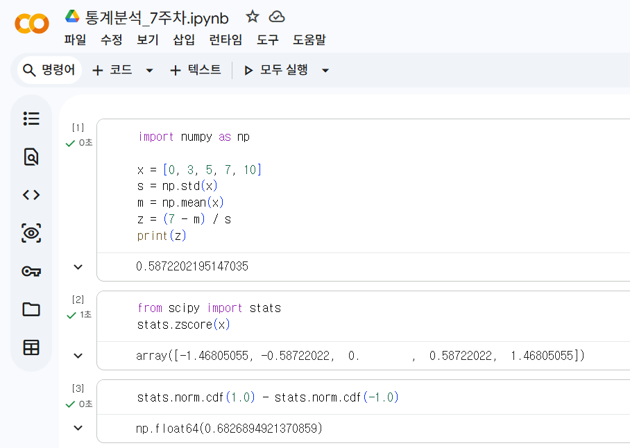
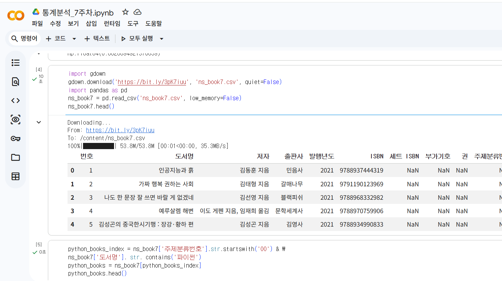
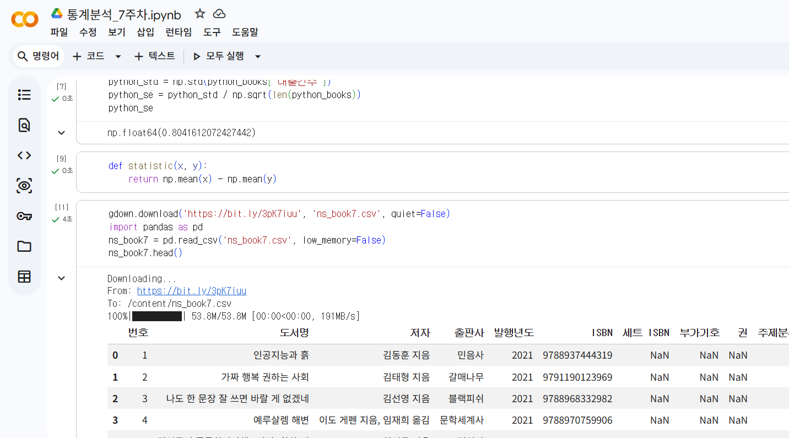
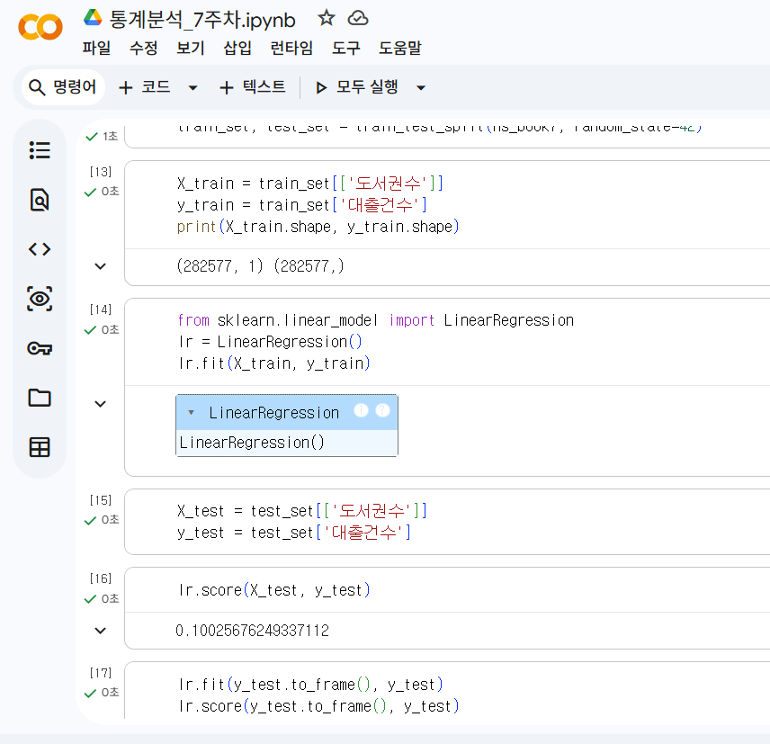

# 데이터분석 7주차 정규과제

📌데이터분석 정규과제는 매주 정해진 분량의 『*혼자 공부하는 데이터 분석 with 파이썬*』 을 읽고 학습하는 것입니다. 이번 주는 아래의 **DataAnalysis_7th_TIL**에 나열된 분량을 읽고 공부하시면 됩니다.

아래의 문제를 풀어보며 학습 내용을 점검하세요. 문제를 해결하는 과정에서 개념을 스스로 정리하고, 필요한 경우 제시된 강의를 참고하여 보완하는 것이 좋습니다.

<!-- 강의 링크는 아래와 같습니다.
https://www.youtube.com/watch?v=R3E4m8fqUSg&list=PLVsNizTWUw7FGzSRCkQrPEEe-ljVXgS7k&index=14
https://www.youtube.com/watch?v=W_cxRstQUk8&list=PLVsNizTWUw7FGzSRCkQrPEEe-ljVXgS7k&index=15
-->


## DataAnalysis_7th_TIL

### 7장 검증하고 예측하기
#### 01. 통계적으로 추론하기
#### 02. 머신러닝으로 예측하기


## Study Schedule

| 주차  | 공부 범위     | 완료 여부 |
| ----- | ------------- | --------- |
| 1주차 | p.24~81    | ✅         |
| 2주차 | p.84~151   | ✅         |
| 3주차 | p.154~219  | ✅         |
| 4주차 | p.222~279 | ✅         |
| 5주차 | p.282~325 | ✅         |
| 6주차 | p.328~379 | ✅         |
| 7주차 | p.382~430 | ✅         |

<br>

<!-- 여기까진 그대로 둬 주세요-->


# 1️⃣ 개념 정리 

## 01. 통계적으로 추론하기

1. 모수검정
- 모집단에 대한 파라미터를 추정하는 방법

2. 표준점수 구하기
- 데이터가 정규분포 따른다고 가정
- 각 값이 평균에서 얼마나 떨어져 있는지 표준편차로 변환한 점수를 표준점수 또는 z 점수라고 함

3. 중심극한정리
- 무작위로 샘플을 뽑아 만든 표본의 평균은 정규분포에 가깝다

4. 신뢰구간
- 표본의 파라미터가 속할 것이라 믿는 모집단의 파라미터 범위

5. 가설검정
- 귀무가설: 두 표본이 같다
- 대립가설: 두 표본이 같지 않다

6. 순열검정
- 정규분포가 아닐 때 가설 검증
- 비모수검정의 한 방법


## 02. 머신러닝으로 예측하기

1. 머신러닝 용어
- 인공지능: 머신러닝은 인공지능의 하위 분야
- 지도학습: 각 샘플에 대한 정답을 알고 있는 경우
- 비지도학습: 데이터는 있지만 타깃이 없는 경우
- 사이킷런: 머실러닝 패키지
- 모델

2. 모델 훈련하기
- train / test 세트 나누기

3. 결정계수
- 훈련된 모델 평가

4. 선형 회귀
- 선형 함수를 사용해 모델을 만드는 알고리즘

5. 로지스틱 회귀
- 분류 알고리즘의 대표적인 알고리즘
- 선형 함수를 사용하지만 예측을 만들기 전에 로지스틱 함수를 거침


# 2️⃣ 수행 인증







<br>
<br>

# 3️⃣ 확인 문제

## 문제 1.

> **🧚Q. 어떤 표본의 크기가 충분히 크고(n ≥ 30), 모집단 분산을 알 수 없을 때 모평균에 대한 신뢰구간을 구하려고 한다.
이때 다음 설명 중 가장 적절한 것은 무엇인가?**

```
1️⃣ 표본의 크기가 충분히 크므로 중심극한정리에 의해 표본평균의 분포는 근사적으로 정규분포를 따른다.  
2️⃣ 모집단 분산을 모르므로 신뢰구간을 구할 수 없다.  
3️⃣ 표본이 30개 이상이면 항상 모집단도 정규분포를 따른다.  
4️⃣ 중심극한정리는 모집단이 정규분포일 때만 적용된다.
```

```
1번

- 표본 크기 n≥30이면 중심극한정리에 의해 표본평균의 분포가 근사적으로 정규분포를 따릅니다.
- 모집단 분산을 몰라도 표본분산을 사용하여 신뢰구간을 구할 수 있습니다.
- 보통 이 경우 표준정규분포(z) 또는 t분포를 활용합니다.
```

## 문제 2.

> **🧚Q. 다음 중 순열검정(permutation test)에 대한 설명으로 가장 옳은 것은 무엇인가?**

```
1️⃣ 모집단이 정규분포를 따른다는 가정을 반드시 해야 한다.  
2️⃣ 표준점수(z-score)를 이용하여 유의확률을 계산하는 방법이다.  
3️⃣ 데이터의 라벨을 무작위로 섞어 귀무가설 하에서의 분포를 직접 구성하는 비모수적 검정 방법이다.  
4️⃣ 표본의 크기가 충분히 클 때만 사용할 수 있다.
```

```
3번

- 순열검정(permutation test)은 데이터 라벨을 무작위로 섞어 귀무가설 하의 분포를 직접 만드는 비모수 검정입니다.
- 정규성 가정이 필요하지 않습니다.
```


### 🎉 수고하셨습니다.