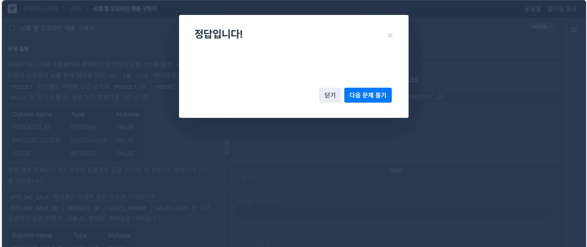
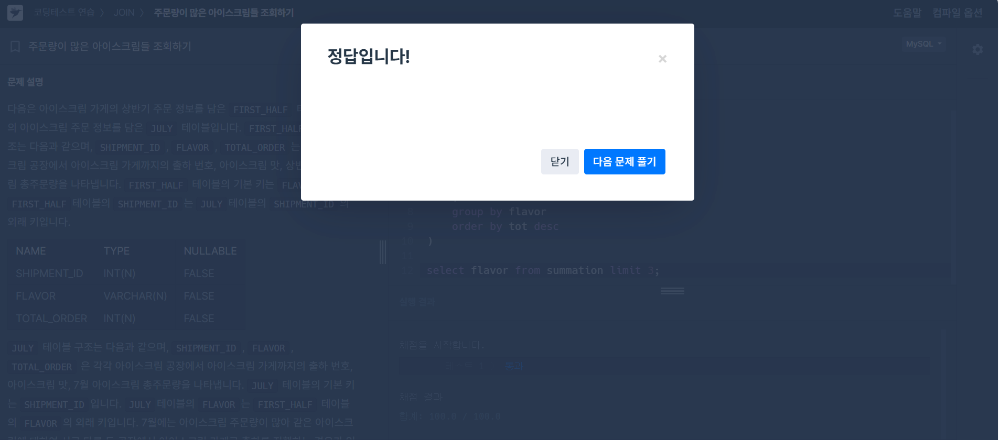

# SQL_BASIC 6주차 정규 과제 

📌SQL_BASIC 정규과제는 매주 정해진 분량의 `초보자를 위한 BigQuery(SQL) 입문` 강의를 듣고 간단한 문제를 풀면서 학습하는 것입니다. 이번주는 아래의 **SQL_Basic_6th_TIL**에 나열된 분량을 수강하고 `학습 목표`에 맞게 공부하시면 됩니다.

**6주차 과제는 강의 내용을 정리하는 것과 함께, 프로그래머스에서 제공하는 SQL 문제를 직접 풀어보는 실습도 병행합니다.** 강의에서는 **배운 내용을 정리하고 주요 쿼리 예제를 정리**하며, 프로그래머스 문제는 **직접 풀어본 뒤 풀이 과정과 결과, 배운 점을 함께 기록**해주세요. 완성된 과제는 Github에 업로드하고, 링크를 스프레드시트 'SQL' 시트에 입력해 제출해주세요.

**👀(수행 인증샷은 필수입니다.)** 

## SQL_BASIC_6th

### 섹션 6. 다량의 자료를 연결 : JOIN 

### 5-1. Intro

### 5-2. JOIN 이해하기

### 5-3. 다양한 JOIN 방법

### 5-4. JOIN 쿼리 작성하기 

### 5-5. JOIN을 처음 공부할 때 헷갈렸던 부분

### 5-6. JOIN 연습문제 1~2번

### 5-6. JOIN 연습문제 3~5번

### 5-7. 정리


## 🏁 강의 수강 (Study Schedule)

| 주차  | 공부 범위              | 완료 여부 |
| ----- | ---------------------- | --------- |
| 1주차 | 섹션 **1-1** ~ **2-2** | ✅         |
| 2주차 | 섹션 **2-3** ~ **2-5** | ✅         |
| 3주차 | 섹션 **2-6** ~ **3-3** | ✅         |
| 4주차 | 섹션 **3-4** ~ **4-4** | ✅         |
| 5주차 | 섹션 **4-4** ~ **4-9** | ✅         |
| 6주차 | 섹션 **5-1** ~ **5-7** | ✅         |
| 7주차 | 섹션 **6-1** ~ **6-6** | 🍽️         |

<!-- 여기까진 그대로 둬 주세요-->

<br>

---

# 1️⃣ 개념정리

## 5-2. JOIN 이해하기

~~~
✅ 학습 목표 :
* JOIN에 대한 정의와 필요성에 대해 설명할 수 있다.
~~~

1. 정의: 서로 다른 데이터 테이블을 연결하는 것
2. 공통적으로 종재하는 컬럼이 있다면 JOIN할 수 있음
3. 여러 테이블 연결 가능


## 5-3. 다양한 JOIN 방법

~~~
✅ 학습 목표 :
* JOIN 방법들의 종류를 설명할 수 있다. 
* 각 JOIN 방법들의 차이점에 대해서 설명할 수 있다. 
~~~

1. 종류
    1) (inner): 공통 요소만
    2) left/right (outer): 오른쪽 / 왼쪽 기준
    3) full (outer): 양쪽 기준
    4) cross: 두 테이블 각각 요소 곱하기
    >> 어렵다면 left join만 주로 사용해도 good


## 5-4. JOIN 쿼리 작성하기 

~~~
✅ 학습 목표 :
* JOIN을 사용한 문법에 대해 이해하여 적용할 수 있다.
* JOIN 을 활용한 쿼리를 작성할 수 있다. 
~~~

1. 흐름
    1) 테이블 확인
    2) 기준 테이블 전의
    3) join key 찾기
    4) 결과 예상하기
    5) 쿼리 작성 및 검증

```sql
select
    a.col1,
    a.col2,
    b.col1,
    b.col2
from table1 as a
left join table2 as b
on a.key=b.key # Alias(별칭) 사용 가능
```


## 5-6. JOIN 연습문제 1~5번 

~~~
✅ 학습 목표 :
* 연습문제(3문제 이상) 푼 것들 정리하기
~~~

1. 연습문제 1번: 트레이너가 보유한 포켓몬들은 얼마나 있은지 알 수 있는 쿼리 작성
    1) 보유했다: status가 Active, Training인 경우
    2) Released: 방출했다
```sql
select
    tp.*,
    p.id,
    p.kor_name
from(
select
    -- id,
    -- trainer_id,
    -- pokemon_id,
    p.kor_name -- 한 테이블에만 있는 경우 테이블 지정 안 해도 됨
    status
from basic.trainer_pokemon
where
    status in ("Active", "Training")
) as tp
left join basic.pokemon as p
on tp.pokemon.id = p.id
group by kor_name
order by pokemon_cnt desc
```


2. 연습문제 3번: 트레이저의 고향과 포켓몬을 포획한 위치를 비교하여, 자신의 고향에서 포켓몬을 포획한 트레이너의 수를 계산해라
    1) status 상관 없이
```sql
select
    count(distinct tp.trainer_id) as trainer.uniq
from basic.trainer as t
left join basic.trainer_pokemon as tp
on t.id = tp.trainer_id
where
    tp.location is not null
    and t.hometown = tp.location
-- where
--     current_health is null -- 모든 트레이너가 포켓몬을 잡아봄
```


3. 연습문제 5번: Incheon 출신 트레이너들은 1세대 2세대 포켓몬을 각각 얼마나 보유하고 있는가
```sql
select
    generation,
    count(tp.id) as pokemon_cnt
from (
select
    id,
    trainer_id,
    pokemon_id,
    status
from basic.trainer_pokemon
where
    sattus in ('Ative', 'Training')
) as tp
left join basic.trainer as t
on trainer_pokemon.trainer_id = t.id
left join basic.pokemon as p
on trainer_pokemon.trainer_id = p.id
where
    t.hometown = "Incheon"
group by
    generation
```


<br>

<br>

---

# 2️⃣ 확인문제 & 문제 인증

## 프로그래머스 문제 

https://school.programmers.co.kr/learn/courses/30/lessons/131533

> 상품 별 오프라인 매출 구하기

https://school.programmers.co.kr/learn/courses/30/lessons/133027

> 주문량이 많은 아이스크림들 조회하기





---

# 3️⃣ 참고자료

JOIN 에 대해서 그림으로 쉽게 이해할 수 있는 자료들도 있어서 첨부합니다. 아래의 블로그도 학습할 때 같이 참고해주세요.

1. https://data-marketing-bk.tistory.com/entry/SQL-JOIN-%ED%95%9C-%EB%B0%A9%EC%97%90-%EC%A0%95%EB%A6%AC-%EA%B0%9C%EB%85%90%EB%B6%80%ED%84%B0-%EC%BD%94%EB%93%9C%EA%B9%8C%EC%A7%80-%EC%9D%B4%EA%B2%83%EB%A7%8C-%EB%B3%B4%EC%9E%90


2. https://velog.io/@wijoonwu/JOIN

<br>

### 🎉 수고하셨습니다.