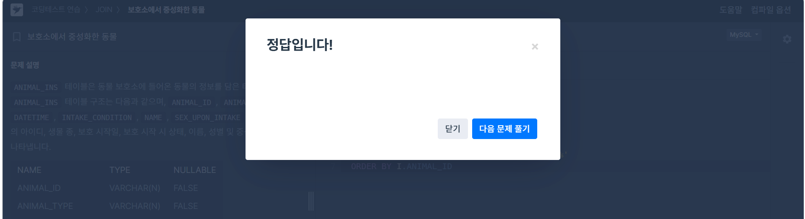
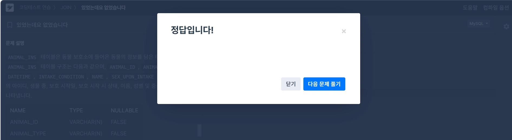
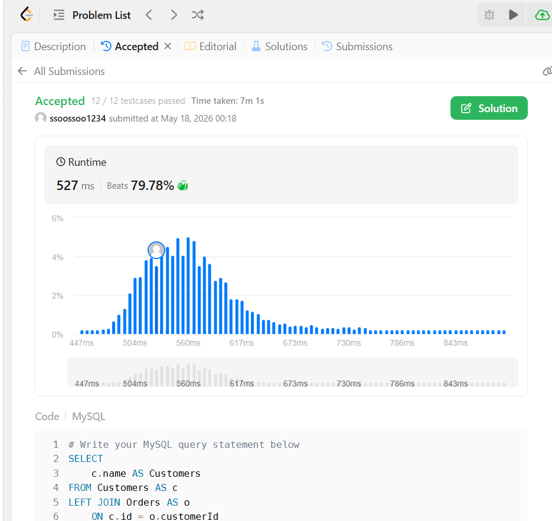
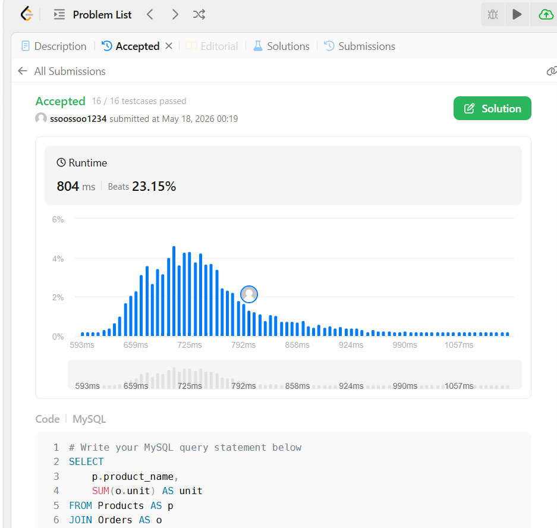

# SQL_BASIC 7주차 정규 과제 

📌SQL_BASIC 정규과제는 매주 정해진 분량의 `초보자를 위한 BigQuery(SQL) 입문` 강의를 듣고 간단한 문제를 풀면서 학습하는 것입니다. 이번주는 아래의 **SQL_Basic_7th_TIL**에 나열된 분량을 수강하고 `학습 목표`에 맞게 공부하시면 됩니다.

**7주차 과제는 강의 내용을 정리하는 것과 함께, 프로그래머스에서 제공하는 SQL 문제를 직접 풀어보는 실습도 병행합니다.** 강의에서는 **배운 내용을 정리하고 주요 쿼리 예제를 정리**하며, 프로그래머스 문제는 **직접 풀어본 뒤 풀이 과정과 결과, 배운 점을 함께 기록**해주세요. 완성된 과제는 Github에 업로드하고, 링크를 스프레드시트 'SQL' 시트에 입력해 제출해주세요.

**👀(수행 인증샷은 필수입니다.)** 

## SQL_BASIC_7th

### 섹션 7 데이터 결과 검증, 가독성 있는 쿼리 작성하기

### 6-1. Intro

### 6-2. 가독성을 챙기기 위한 SQL 스타일 가이드

### 6-3. 가독성을 챙기기 위한 WITH 문 & 파티션

### 6-4. 데이터 결과 검증 정의

### 6-5. 데이터 결과 검증 예시

### 6-6. 정리 

## 🏁 강의 수강 (Study Schedule)

| 주차  | 공부 범위              | 완료 여부 |
| ----- | ---------------------- | --------- |
| 1주차 | 섹션 **1-1** ~ **2-2** | ✅         |
| 2주차 | 섹션 **2-3** ~ **2-5** | ✅         |
| 3주차 | 섹션 **2-6** ~ **3-3** | ✅         |
| 4주차 | 섹션 **3-4** ~ **4-4** | ✅         |
| 5주차 | 섹션 **4-4** ~ **4-9** | ✅         |
| 6주차 | 섹션 **5-1** ~ **5-7** | ✅         |
| 7주차 | 섹션 **6-1** ~ **6-6** | ✅         |

 

<!-- 여기까진 그대로 둬 주세요-->

---

# 1️⃣ 개념정리

## 6-2. 가독성을 챙기기 위한 SQL 스타일 가이드

~~~
✅ 학습 목표 :
* 데이터 결과 검증하기 전에 실수가 발생하는 원인을 설명할 수 있다.
* SQL 쿼리를 가독성 있게 작성할 수 있다. 
~~~

**SQL 스타일 가이드**
- SQL 스타일 가이드
- Mozilla SQL 스타일 가이드

1. 예약어는 대문자로 작성
2. 컬럼 이름 snake_case로 작성
3. 명시적 vs 암시적 이름 >> 명시적인 걸로 사용
4. 왼쪽 정렬
5. 예약어나 컬럼은 한 줄에 하나씩
6. 쉼표는 컬럼 바로 뒤에

## 6-3. 가독성을 챙기기 위한 WITH문 & 파티션

~~~
✅ 학습 목표 :
* SQL 쿼리를 가독성 있게 작성할 수 있다. 
* WITH문과 파티션을 활용해서도 가독성을 챙길 수 있다. 
~~~

1. WITH 구문
- WITH를 사용해 쿼리 정의해서 재사용 가능
- CTE (Common Table Expression)
- SELECT 구문에 이름 정해주는 것과 유사

2. PARTITION
- 쿼리 성능 향상
- 데이터 관리 용이
- 비용 절감
- battle table에서 battel_datetime이 파티션으로 만든 테이블

## 6-4. 데이터 결과 검증 정의 

~~~
✅ 학습 목표 :
* 데이터 결과 검증이 어떤 과정인지 설명할 수 있다. 
* 데이터 결과 검증에 대한 예시를 이해할 수 있다.  
~~~

1. 데이터 결과 검증의 정의
- 결과가 예상과 일치하는지 확인
- 목적: 분석 결과의 정확성과 신뢰성 확보
- 방법: 예상 결과 정의 >> 쿼리 작성 >> 두 개가 일치하는지 비교

2. 데이터 결과 검증 흐름
- 문제 정의 확인
- Input/Output
- 쿼리 작성
- 결과 비교

3. 데이터 결과 검증에 활용하는 SQL 쿼리
- COUNT(*)
- NOT NULL
- DISTINCT
- IF, CASE WHEN

 

 

---

# 2️⃣ 확인문제 & 문제 인증

## 프로그래머스 문제 

https://school.programmers.co.kr/learn/courses/30/lessons/131117

> 5월 식품들의 총매출 조회하기

https://school.programmers.co.kr/learn/courses/30/lessons/59045

> 보호소에서 중성화한 동물

https://school.programmers.co.kr/learn/courses/30/lessons/59043

> 있었는데요 없었습니다.

## LeetCode 문제

https://leetcode.com/problems/customers-who-never-order/

> 183. Customers Who Never Order

https://leetcode.com/problems/list-the-products-ordered-in-a-period/

> 585. Investments in 2016

## 문제 1

> **🧚예운이는 다음 SQL 쿼리를 다트비 정규과제에 제출했다. 제출한 쿼리는 다음과 같고, 이 쿼리는 에러 메시지 없이 잘 수행하는 쿼리이다.**

~~~sql
# 예운이가 작성한 가독성 나쁜 SQL 

select u.name , o.OrderID
, p.ProductName ,od.Quantity ,od.UnitPrice 	from Users u	join Orders o on u.id = o.userId
join OrderDetails od on o.OrderID = od.orderID	join Products p on od.ProductID = p.ProductID
where u.region= 'Busan'			order by o.OrderID
~~~

> **이에 과제를 검사하던 진아는 작성한 SQL을 보고 코드 리뷰를 진행하려고 했지만, 다음 쿼리를 보고 예운이에게 질문을 하였다. "예운아, 이 쿼리 가독성이 좀 안 좋은데 내가 고쳐도 괜찮을까? 가독성 좋게 SQL 가이드에 따라 정리해보려고 해"**
>
> 다음 SQL 쿼리를 **가독성 좋은 스타일로 다시 작성해보세요.** 

~~~
SELECT
    u.name,
    o.OrderID,
    p.ProductName,
    od.Quantity,
    od.UnitPrice
FROM Users AS u
JOIN Orders AS o
    ON u.id = o.userId
JOIN OrderDetails AS od
    ON o.OrderID = od.orderID
JOIN Products AS p
    ON od.ProductID = p.ProductID
WHERE u.region = 'Busan'
ORDER BY o.OrderID
~~~

---

한 학기 동안 다소 부족한 커리큘럼이었음에도 불구하고 성실하게, 그리고 열심히 과제를 수행해주셔서 진심으로 감사드립니다.

이번 과정을 통해 배운 내용이 앞으로 여러분이 SQL을 다루는 데에 조금이나마 도움이 되기를 바랍니다.

여러분의 앞날을 진심으로 응원합니다. 😊

 

 

### 🎉 수고하셨습니다.