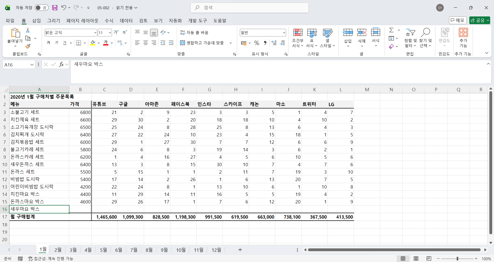
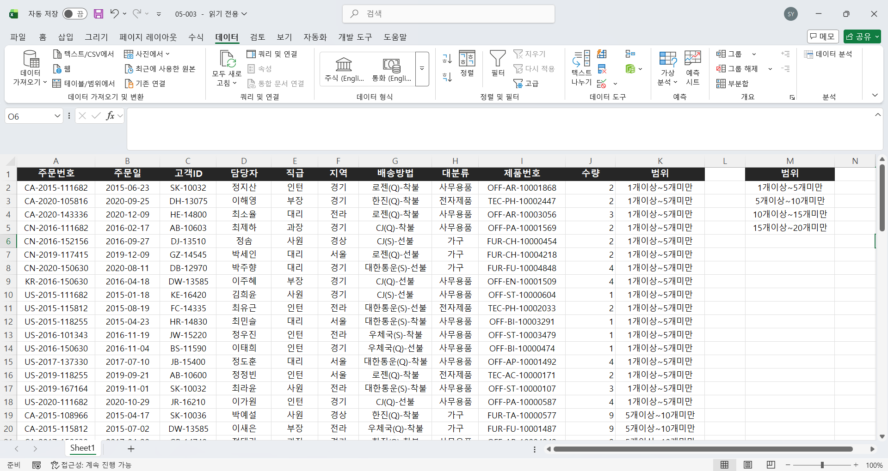
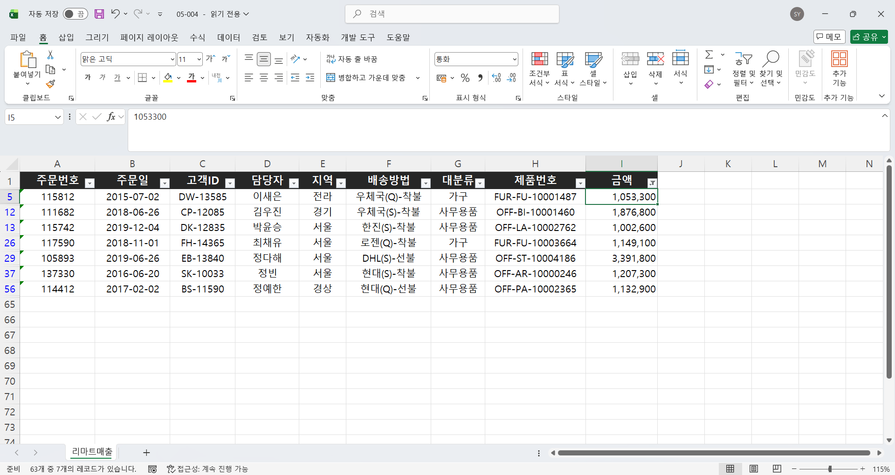
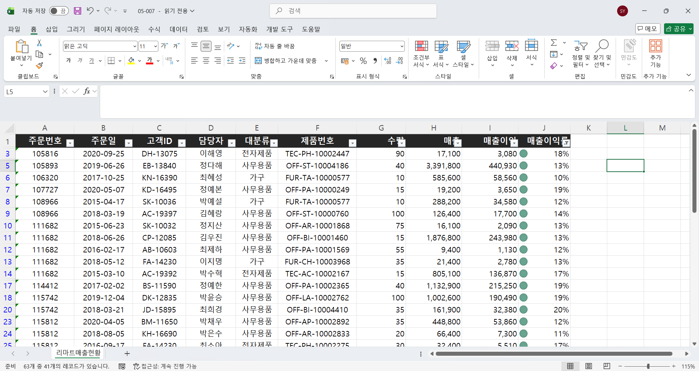
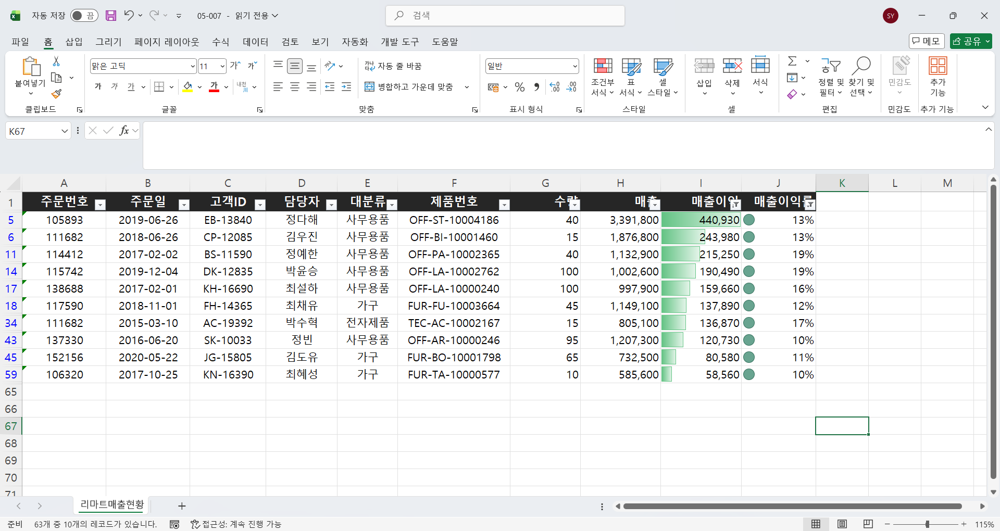
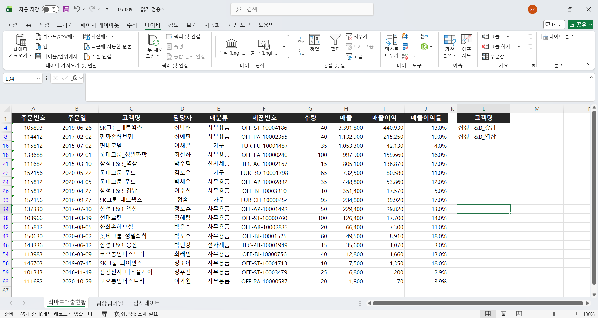
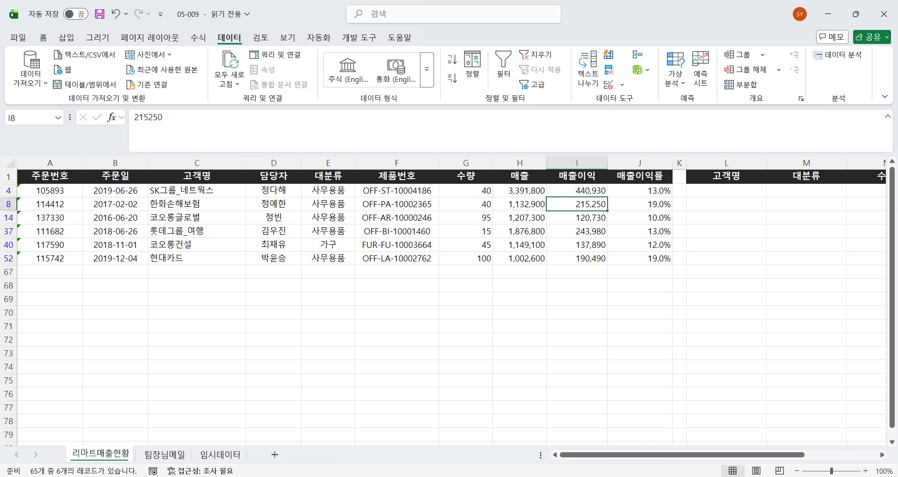
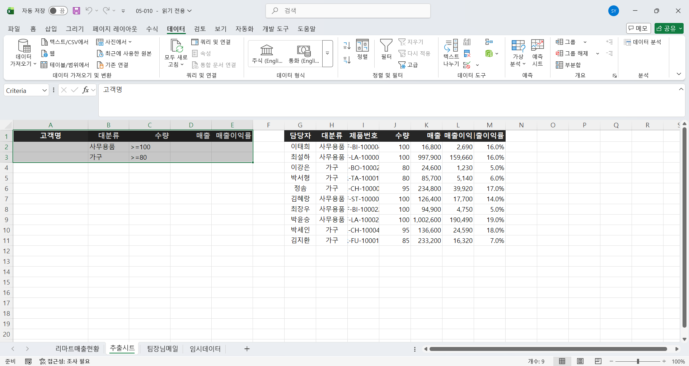

# Excel 4주차 정규 과제 

📌Excel 정규과제는 매주 정해진 분량의 『*진짜 쓰는 실무 엑셀*』 을 읽고 학습하는 것입니다. 이번주는 아래의 **EXCEL_4th_TIL**에 나열된 분량을 읽고 공부하시면 됩니다.

아래의 문제를 풀어보며 학습 내용을 점검하세요. 문제를 해결하는 과정에서 개념을 스스로 정리하고, 필요한 경우 제시된 강의를 참고하여 보완하는 것이 좋습니다.

**교재 실습 예제 파일은 1주차 과제 설명 노션에 있습니다. 해당 파일을 다운 후 실습 진행해주시면 됩니다.**

**👀(수행 인증샷은 필수입니다.)** 

## EXCEL_4th_TIL

### 5장 데이터 정리부터 데이터 필터링까지
#### 01. 엑셀 데이터 관리의 기본 규칙
#### 02. 나만의 목록을 만들어 원하는 순서대로 정렬하기
#### 03. 조건에 맞는 데이터만 확인하는 자동 필터
#### 04. 자동 필터와 정렬 기능으로 판매 현황 보고서 만들기
#### 05. 필터 결과를 손쉽게 집계하는 SUBTOTAL 함수 (범위 제외)
#### 06. 원본 데이터는 유지하고, 다양한 조건을 지정하는 고급 필터
#### 07. 데이터 관리 자동화를 위한 파워 쿼리 활용하기 (범위 제외)

## Study Schedule

| 주차  | 공부 범위     | 완료 여부 |
| ----- | ------------- | --------- |
| 1주차 | p.22~111    | ✅         |
| 2주차 | p.112~157   | ✅         |
| 3주차 | p.158~213  | ✅         |
| 4주차 | p.214~273 | ✅         |
| 5주차 | p.274~339 | 🍽️         |
| 6주차 | p.340~425 | 🍽️         |
| 7주차 | p.426~472 | 🍽️         |

 

<!-- 여기까진 그대로 둬 주세요-->

---

# 1️⃣ 학습 내용 정리

## 05-1. 엑셀 데이터 관리의 기본 규칙
> **데이터 관리를 할 때 주의해야 할 점에 대해 설명해주세요.**
<!-- 이 부분을 지우고 작성해주세요.-->

### 1️⃣ 줄 바꿈, 빈 셀 사용 X

**1. 줄 바꿈 문제**

- 텍스트와 날짜가 한 셀에 줄 바꿈으로 입력되어 있으면 기본적인 수식 계산 시 오류 발생
- 근속 연수 따로 추출 후 계산해야 되는데 데이터가 많을수록 작업량 상당해짐

**2. 빈 셀 문제**

- 빈 셀이 포함되면 단축키가 제 역할 하지 못함
- 빈 셀 참조 시 0 반환됨

### 2️⃣ 집계 데이터와 원본 데이터는 구분하여 관리

**1. 함수 사용 어려움**

- 품목별 소계가 있으면 원본 데이터 또는 집계값 따로 선택해야 함

**2. 피벗 테이블 사용 어려움**

- 원본 데이터와 집계 데이터 혼재시 집계에 문제가 생길 수 있음

**3. 따로 관리해야 파일 크기 최소화 가능**

- 집계 데이터를 최소화할수록 원본 데이터 크기를 최소화할 수 있음

### 3️⃣ 머리글은 반드시 한 줄로 입력

**1. 범위 선택 문제**

- 셀 병합시 입력 또는 드래그로 번거롭게 범위 지정해야 함

**2. 표, 피벗 테이블 활용 문제**

- 셀 병합된 머리글이 분리되면서 다른 곳에 필터가 적용되는 문제 발생
- 병합된 범위 선택 후 피벗 테이블 제작시 '필드 이름이 잘못되었다'는 오류 발생

### 4️⃣ 세로 방향 블록 쌓기

- 새로운 데이터는 아래 방향으로 추가
- 새로운 항목은 오른쪽으로 추가

> **여러 시트를 동시에 편집하기(223 ~ 224p)를 진행 후 인증사진을 첨부해주세요.**
<!-- 이 부분을 지우고 인증사진을 제출해주세요.-->

## 05-2. 나만의 목록을 만들어 원하는 순서대로 정렬하기
> **데이터에서 고유 값 찾고, 사용자 지정 목록 등록하기(228 ~231p)를 진행 후 인증사진을 첨부해주세요.**
<!-- 이 부분을 지우고 인증사진을 제출해주세요.-->

## 05-3. 조건에 맞는 데이터만 확인하는 자동 필터
> **자동 필터에서 조건 지정하여 필터링하기(235 ~236p)를 진행 후 인증사진을 첨부해주세요.**
<!-- 이 부분을 지우고 인증사진을 제출해주세요.-->

## 05-4. 자동 필터와 정렬 기능으로 판매 현황 보고서 만들기
> **매출이익률이 10% 이상인 데이터 필터링(243 ~245p)를 진행 후 인증사진을 첨부해주세요.**
<!-- 이 부분을 지우고 인증사진을 제출해주세요.-->

> **매출이익 Top 10 필터링 후 시각화하기(246 ~247p)를 진행 후 인증사진을 첨부해주세요.**
<!-- 이 부분을 지우고 인증사진을 제출해주세요.-->

## 05-6. 원본 데이터는 유지하고, 다양한 조건을 지정하는 고급 필터
> **여러 고객사 목록을 한방에 필터링하기(251 ~254p)를 진행 후 인증사진을 첨부해주세요.**
<!-- 이 부분을 지우고 인증사진을 제출해주세요.-->

> **AND, OR 조건으로 고급 필터 실행하기(254 ~257p)를 진행 후 인증사진을 첨부해주세요.**
<!-- 이 부분을 지우고 인증사진을 제출해주세요.-->

> **원본과 다른 시트에 필터링 결과 추출하기(258 ~260p)를 진행 후 인증사진을 첨부해주세요.**
<!-- 이 부분을 지우고 인증사진을 제출해주세요.-->

---

### 🎉 수고하셨습니다.

