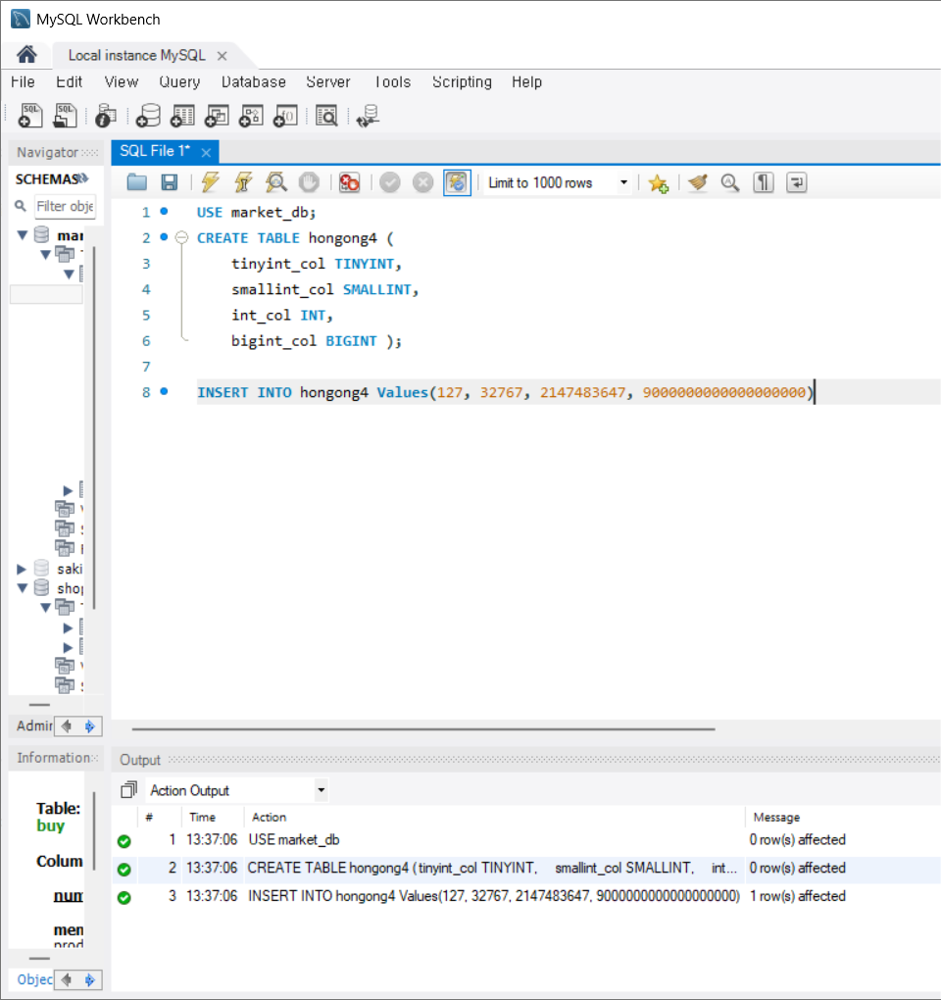
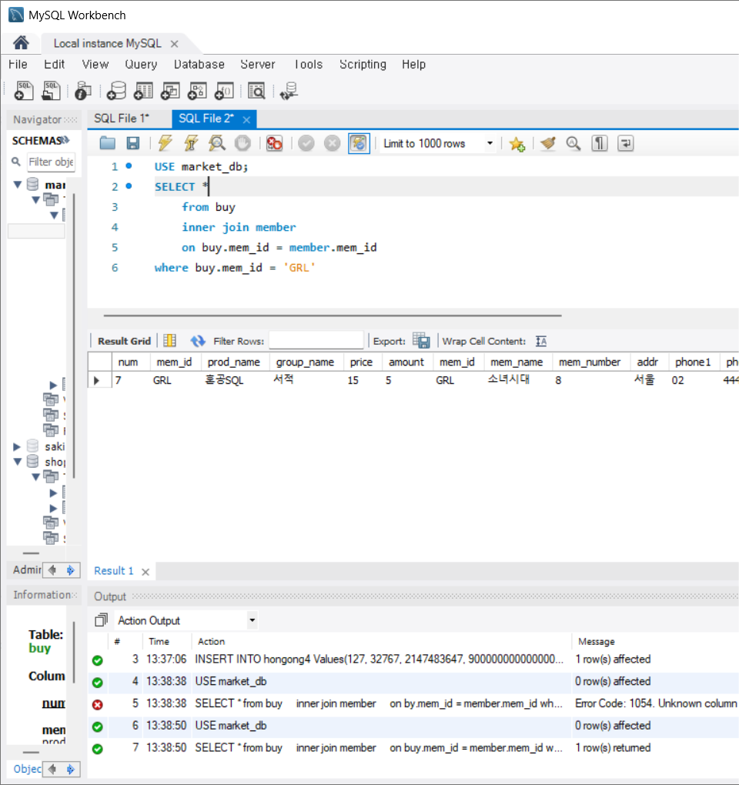
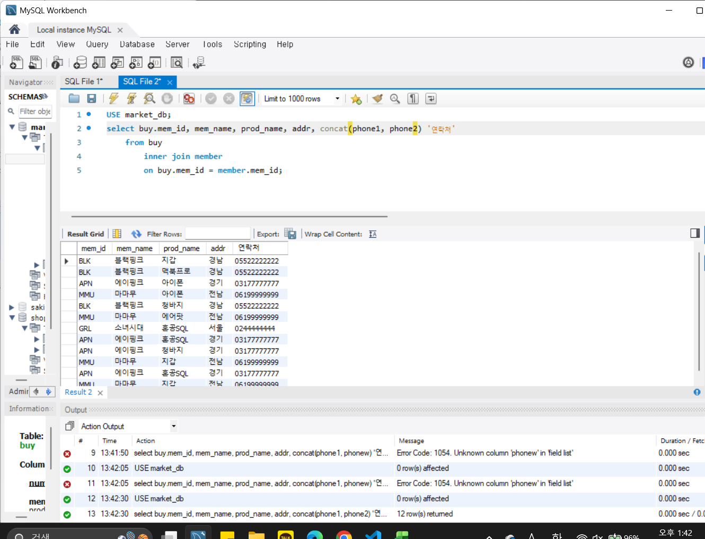
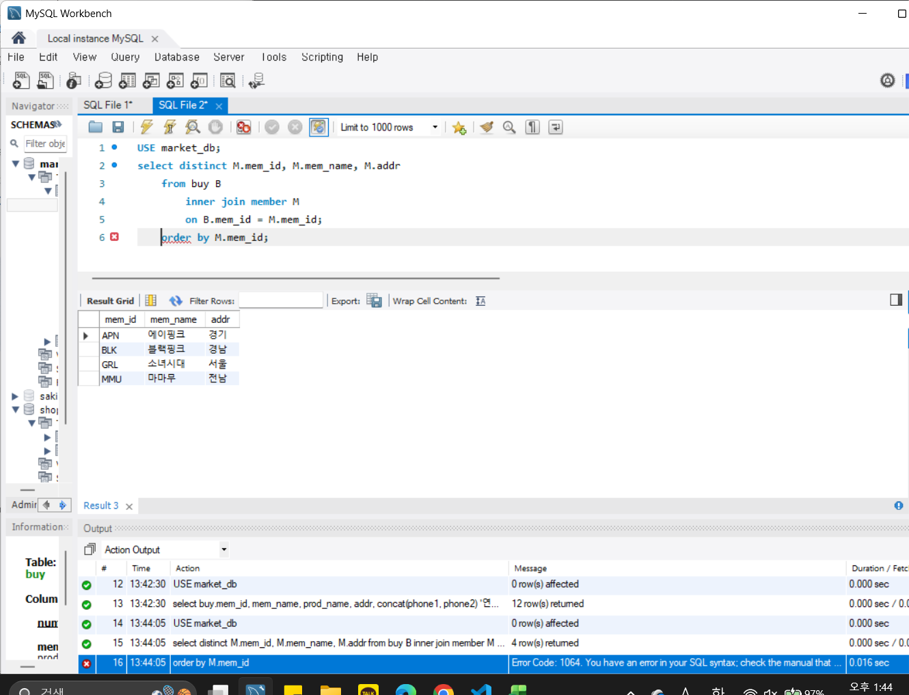
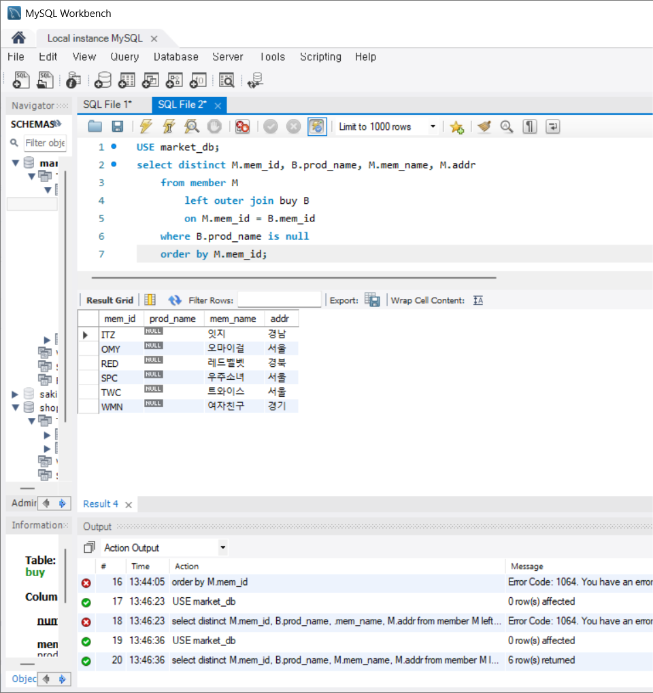
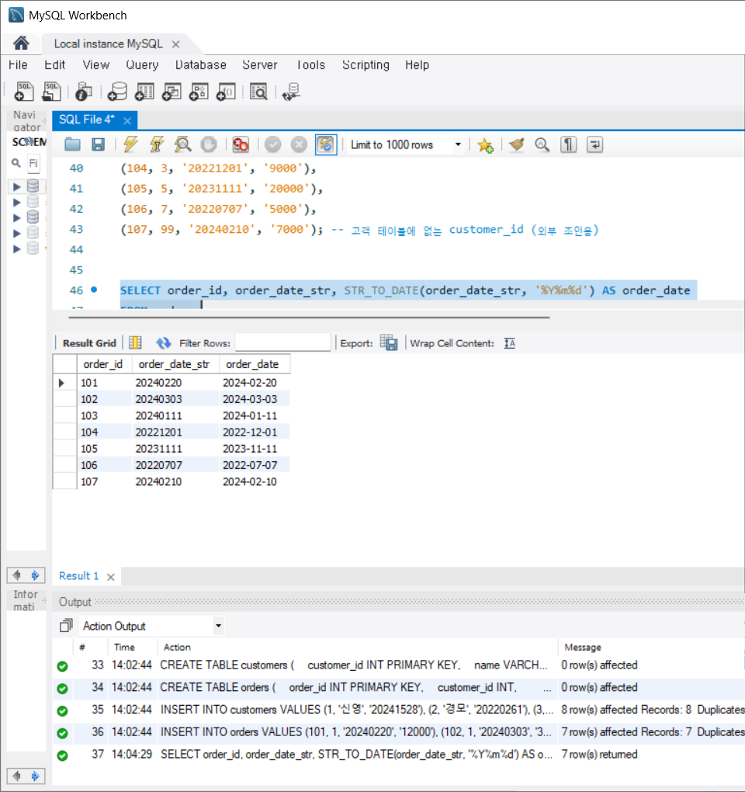
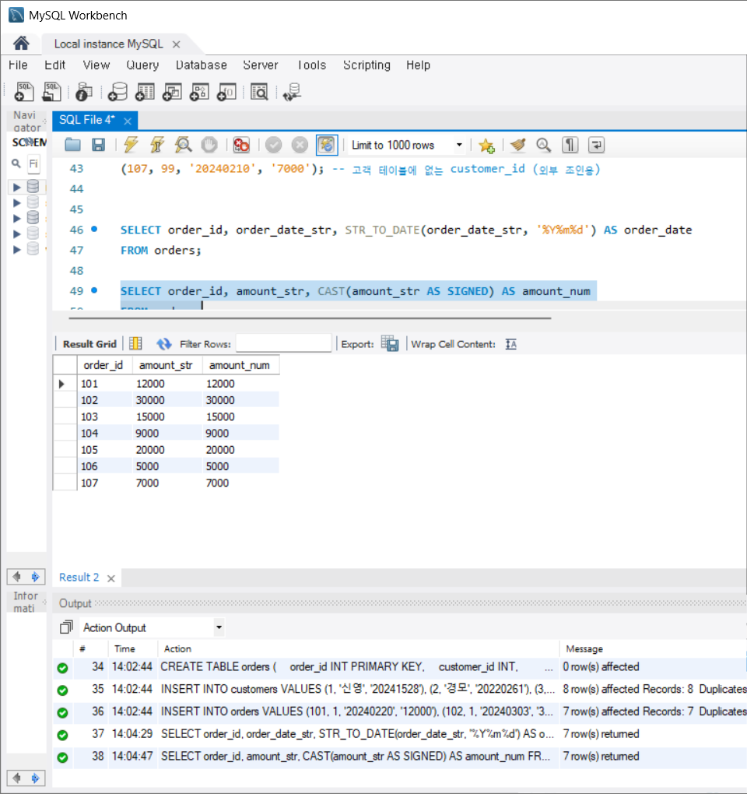
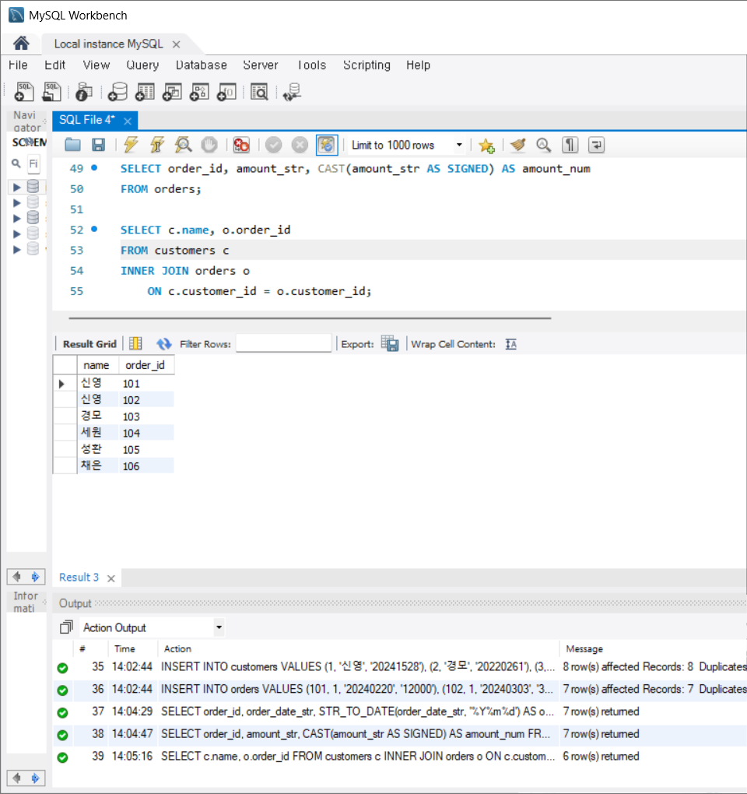
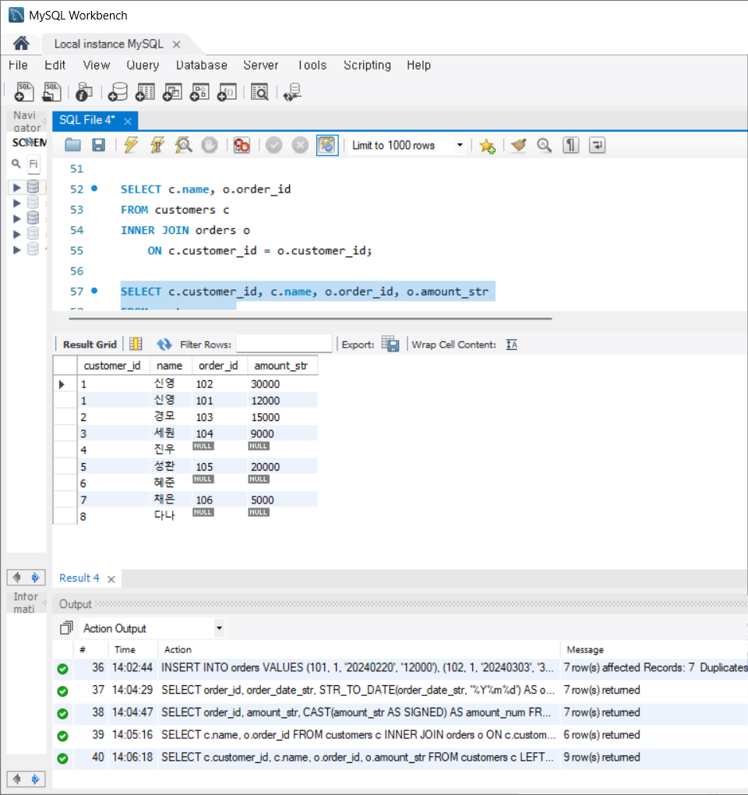
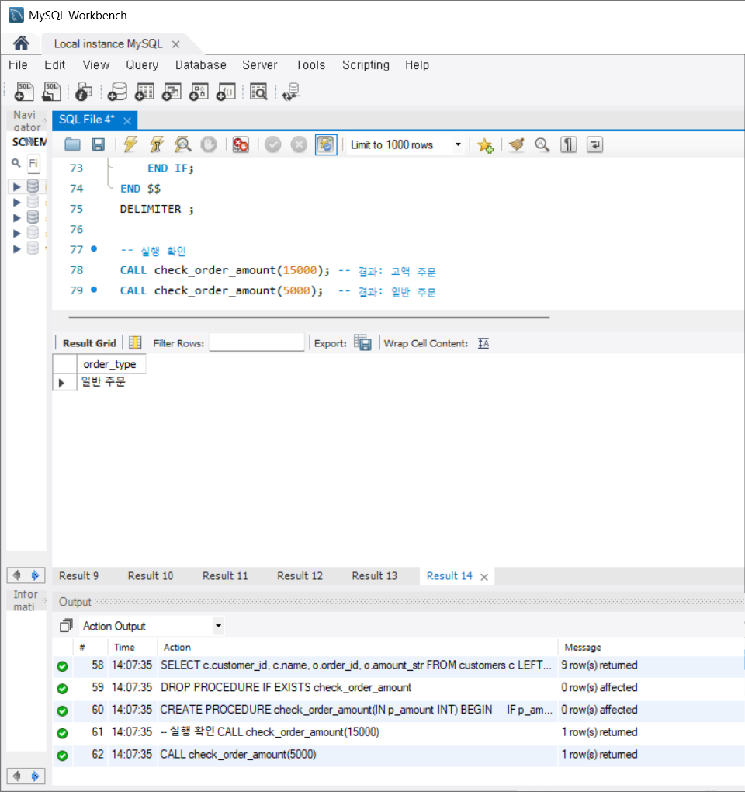

# SQL_ADVANCED 3주차 정규 과제 

📌SQL_ADVANCED 정규과제는 매주 정해진 분량의 『*혼자 공부하는 SQL*』 을 읽고 학습하는 것입니다. 이번주는 아래의 **SQL_ADVANCED_3rd_TIL**에 나열된 분량을 읽고 공부하시면 됩니다.

아래의 문제를 풀어보며 학습 내용을 점검하세요. 문제를 해결하는 과정에서 개념을 스스로 정리하고, 필요한 경우 제시된 강의를 참고하여 보완하는 것이 좋습니다.

<!-- 강의 링크는 아래와 같습니다.
https://www.youtube.com/watch?v=1YmWy-7-OhQ&list=PLVsNizTWUw7GCfy5RH27cQL5MeKYnl8Pm&index=10
https://www.youtube.com/watch?v=tuQFkzjqEGw&list=PLVsNizTWUw7GCfy5RH27cQL5MeKYnl8Pm&index=11
https://www.youtube.com/watch?v=IOCsreDYqFE&list=PLVsNizTWUw7GCfy5RH27cQL5MeKYnl8Pm&index=12
-->

**교재 실습 예제 파일은 08_SQL_ADVANCED_Template 레포지토리의 src 폴더에 업로드되어 있습니다. market_db 파일도 해당 폴더에 함께 포함되어 있으니 참고하시기 바랍니다.**

**👀(수행 인증샷은 필수입니다.)** 

## SQL_ADVANCED_3rd_TIL

### 4장 SQL 고급 문법
#### 01. MySQL의 데이터 형식
#### 02. 두 테이블을 묶는 조인
#### 03. SQL 프로그래밍 


## Study Schedule

| 주차  | 공부 범위     | 완료 여부 |
| ----- | ------------- | --------- |
| 1주차 | p.24~99    | ✅         |
| 2주차 | p.102~155   | ✅         |
| 3주차 | p.158~213  | ✅         |
| 4주차 | p.216~271 | 🍽️         |
| 5주차 | p.274~327 | 🍽️         |
| 6주차 | p.330~369 | 🍽️         |
| 7주차 | p.372~407 | 🍽️         |


<br>

<!-- 여기까진 그대로 둬 주세요-->

---

# 1️⃣ 학습 내용 정리

## 1. MySQL의 데이터 형식

### 📌 정수형

- 소수점이 없는 숫자
- 가격, 수량 등에 사용 多
- 종류: TINYINT, SMALLINT, INT, BIGINT(점점 더 커지는 바이트 수)


### 📌 문자형

- 글자 저장 위해 사용
- 입력할 최대 글자 수 지정해야 함
- 종류: CHAR(개수), VARCHAR(개수)
- VARCHAR이 CHAR보다 더 많은 바이트 수 커버
- 더 큰 데이터 저장 시 TEXT, BLOB 형식 사용


### 📌 실수형

- 소수점이 있는 숫자 저장
- 종류: FLOAT(소수점 아래 7자리까지), DOUBLE(소수점 아래 15자리까지)


### 📌 날짜형

- 날짜 및 시간 저장에 사용
- 종류: DATE(날짜만 저장, YYYY-MM-DD), TIME(시간만 저장, HH:MM:SS), DATETIME(날짜와 시간 저장, YYYY-MM-DD, HH:MM:SS)


### 📌 데이터 형 변환

- 형 변환: 정수형 → 문자형과 같은 경우
- 명시적인 변환: 함수를 사용해 변환
- 암시적인 변환: 별도의 지시 없이 자연스럽게 변환


> **확인문제: 다음 보기에서 데이터 형식의 변환에 사용되는 함수를 2개 고르세요.**

보기는 아래와 같습니다.
```
CONVERT() / DATA() / CAST() / MOVE() / TYPE() / SUM() / AVG() / CURRENT_DATE()
```

```
CONVERT()와 CAST()

둘 다 명시적인 변환에서 사용되는 함수
형식만 다를 뿐 동일한 기능을 함
```



## 2. 두 테이블을 묶는 조인

<!-- 두 테이블을 묶는 조인에 관해 배우게 된 점을 적어주세요. -->
<!-- 과제 설명 예시처럼 직접 실습 후 인증 사진 4장 이상을 첨부해주세요. -->

### 📌 내부 조인

- 그냥 조인 = 내부 조인
- 두 테이블에 모두 있는 내용만 조인

### 📌 외부 조인

- 조인할 때 필요한 내용이 한쪽 테이블에만 있어도 결과 추출 가능
- LEFT OUTER JOIN, RIGHT OUTER JOIN, FULL OUTER JOIN 있음

### 📌 기타 조인

- 상호 조인: 한쪽 테이블의 모든 행과 다른 쪽 테이블의 모든 행을 조인
- 자체 조인: 자신이 자신과 조인. 대표적으로 회사와 조직의 관계에서 사용


> **확인문제: 다음 SQL은 회원으로 가입만 하고, 한 번도 구매한 적이 없는 회원의 목록을 조회하는 쿼리입니다. 빈칸에 들어갈 가장 적절한 구문을 고르세요..**

```sql
SELECT DISTINCT M.mem_id, B.prod_name, M.mem_name, M.addr
  FROM member M
    LEFT OUTER JOIN buy B
    ON M.mem_id = B.mem_id
  __________
  ORDER BY M.mem_id;
```
보기는 아래와 같습니다.
```
1. JOIN B.prod_name IS NULL
2. LIMIT B.prod_name IS NULL
3. HAVING B.prod_name IS NULL
4. WHERE B.prod_name IS NULL
```
```
4번

단순 필터링을 걸어야 되므로 where을 써야 된다. 1번의 join은 이미 사용되었고, 2번의 limit은 반환할 행의 개수 제한을 위한 것이다. 3번의 having은 group by절과 함께 쓰이는 조건절이다.
```






## 3. SQL 프로그래밍 

<!-- IF문, CASE문, WHILE문에 관해 배우게 된 점을 적어주세요. -->

### 📌 IF 문

- 조건식이 참이면 실행, 그렇지 않으면 그냥 넘어감
- 기본 형식
```sql
IF <조건식> THEN
  SQL문장들
END IF;
```

### 📌 CASE 문

- 2가지 이상의 처리 가능 → `다중분기`
- 기본 형식
```sql
CASE
  WHEN 조건1 THEN
    SQL문장들1
  WHEN 조건2 THEN
    SQL문장들2
  WHEN 조건3 THEN
    SQL문장들3
  ELSE
    SQL문장들4
  END CASE;
```

### 📌 WHILE 문

- 조건식이 참인 동안에만 SQL문장들 계속 반복
- 기본 형식
```sql
WHILE (조건식) DO
  SQL문장들
END WHILE;
```

### 📌 동적 SQL

- 변경되는 내용 실시간 적용
- PREPARE: SQL문을 실행하지 않고 미리 준비만
- EXECUTE: 준비한 SQL문 실행
- DEALLOCATE PREPARE: 실행 후 문장 해제


> **확인문제: 다음은 CASE 문의 형식입니다. 빈칸에 들어갈 가장 적절한 명령어를 보기에서 고르세요..**

```sql
CASE
    (1) 조건 THEN
        SQL문장들1
    ELSE
        SQL문장들4
END (2);
```

보기는 아래와 같습니다.
```
WHEN / THEN / CURRENT / DATE / TIME / IF / END IF / CASE
```

```
여기에 답을 적어주세요!
(1) WHEN
(2) CASE
```


---

# 2️⃣ 실습과제

## 1. 데이터베이스 구축

아래 코드를 MySQL Workbench에 붙여넣은 후,  
**전체 드래그 → 실행 (Ctrl + shift + Enter)** 하여 데이터베이스를 구축하세요.

```sql
-- 1. 데이터베이스 생성
CREATE DATABASE IF NOT EXISTS week3_db;

-- 2. 사용할 데이터베이스 선택
USE week3_db;

-- 3. 기존 테이블 삭제 (초기화용)
DROP TABLE IF EXISTS orders;
DROP TABLE IF EXISTS customers;

-- 4. 테이블 생성 (조인 실습용)
CREATE TABLE customers (
    customer_id INT PRIMARY KEY,
    name VARCHAR(20),
    signup_date_str VARCHAR(8) 
);

CREATE TABLE orders (
    order_id INT PRIMARY KEY,
    customer_id INT,           
    order_date_str VARCHAR(8), 
    amount_str VARCHAR(10)     
);

-- 5. 데이터 삽입
INSERT INTO customers VALUES
(1, '신영', '20241528'),
(2, '경모', '20220261'),
(3, '세원', '20203401'),
(4, '진우', '20221024'),
(5, '성환', '20225100'),
(6, '혜준', '20244946'),
(7, '채은', '20250412'),
(8, '다나', '20212774'); -- 주문 없는 고객(외부 조인용)

INSERT INTO orders VALUES
(101, 1, '20240220', '12000'),
(102, 1, '20240303', '30000'),
(103, 2, '20240111', '15000'),
(104, 3, '20221201', '9000'),
(105, 5, '20231111', '20000'),
(106, 7, '20220707', '5000'),
(107, 99, '20240210', '7000'); -- 고객 테이블에 없는 customer_id (외부 조인용)
```

## 2. 실습 문제

다음 SQL 문을 작성하고 실행 결과를 확인 후 인증 사진을 아래에 업로드하세요.

1. **데이터 형식 변환**
   - orders 테이블의 `order_date_str`을 DATE 형식으로 변환하여 조회하시오.
   (힌트: STR_TO_DATE 사용)



2. **데이터 형식 변환**
   - orders 테이블의 `amount_str`을 숫자형으로 변환하여 조회하시오.



3. **내부 조인 (INNER JOIN)**
   - customers와 orders를 customer_id 기준으로 내부 조인하여
     고객 이름(name)과 주문 번호(order_id)를 함께 조회하시오.



4. **외부 조인 (LEFT JOIN)**
   - customers를 기준으로 LEFT JOIN을 수행하여,
     주문이 없는 고객도 함께 조회하시오.



5. **스토어드 프로시저 (IF문 사용)**
   - 입력받은 금액이 10000 이상이면 '고액 주문',
     그렇지 않으면 '일반 주문'을 출력하는
     프로시저를 생성하시오.
   - 생성 후 CALL로 실행 결과를 확인하시오.




<!-- 이 부분을 지우고 인증사진을 제출해주세요.-->


### 🎉 수고하셨습니다.


