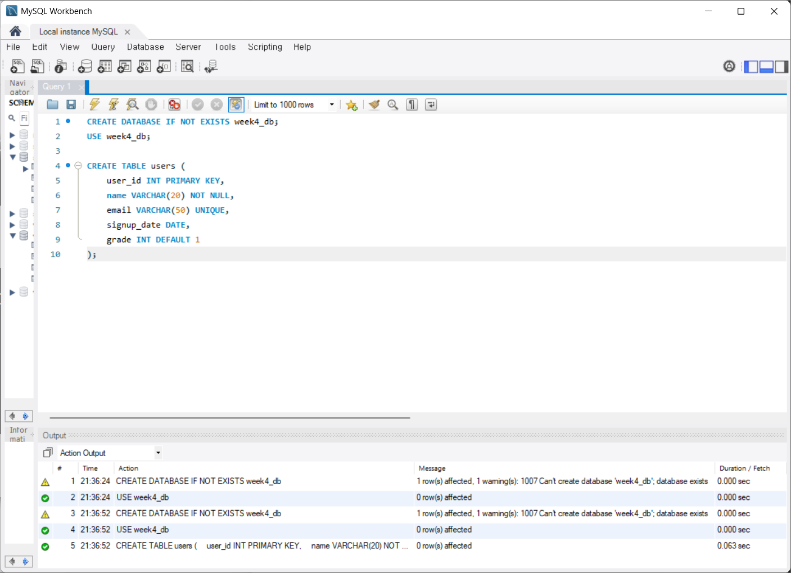
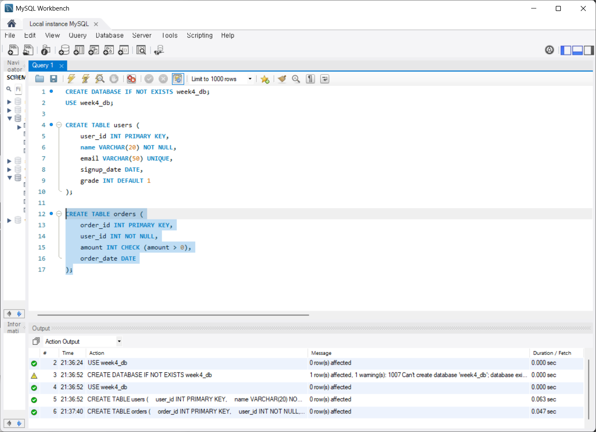
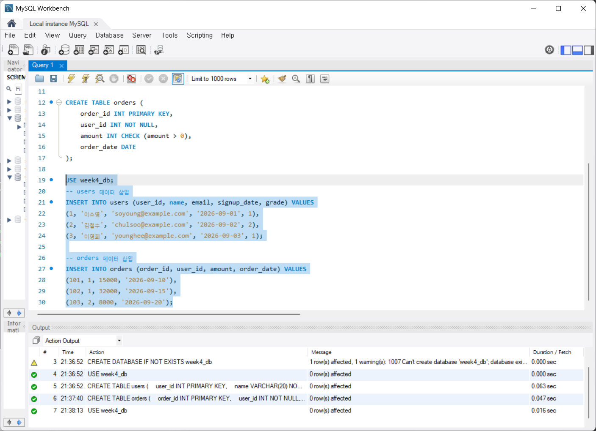
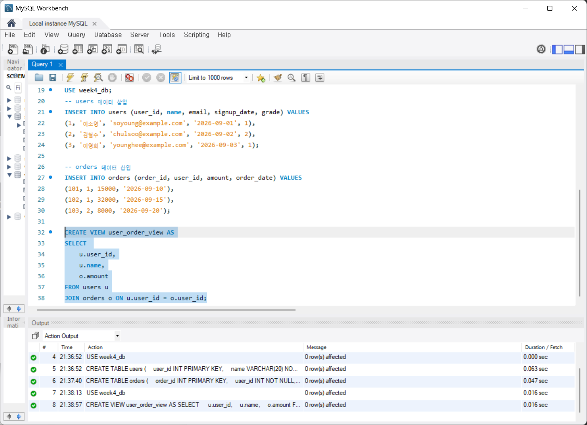
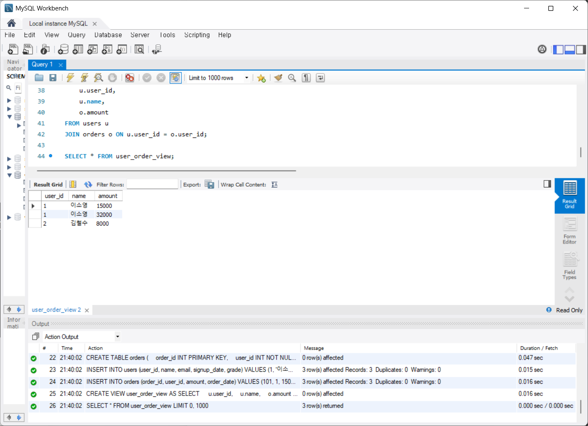

# SQL_ADVANCED 4주차 정규 과제 

📌SQL_ADVANCED 정규과제는 매주 정해진 분량의 『*혼자 공부하는 SQL*』 을 읽고 학습하는 것입니다. 이번주는 아래의 **SQL_ADVANCED_4th_TIL**에 나열된 분량을 읽고 공부하시면 됩니다.

아래의 문제를 풀어보며 학습 내용을 점검하세요. 문제를 해결하는 과정에서 개념을 스스로 정리하고, 필요한 경우 제시된 강의를 참고하여 보완하는 것이 좋습니다.

<!-- 강의 링크는 아래와 같습니다.
https://www.youtube.com/watch?v=DMNpkj_bZIs&list=PLVsNizTWUw7GCfy5RH27cQL5MeKYnl8Pm&index=13
https://www.youtube.com/watch?v=BUHj-behLyc&list=PLVsNizTWUw7GCfy5RH27cQL5MeKYnl8Pm&index=14
https://www.youtube.com/watch?v=JrXWxku7ZIM&list=PLVsNizTWUw7GCfy5RH27cQL5MeKYnl8Pm&index=15
-->

**교재 실습 예제 파일은 08_SQL_ADVANCED_Template 레포지토리의 src 폴더에 업로드되어 있습니다. market_db 파일도 해당 폴더에 함께 포함되어 있으니 참고하시기 바랍니다.**

**👀(수행 인증샷은 필수입니다.)** 

## SQL_ADVANCED_4th_TIL

### 5장 테이블과 뷰
#### 01. 테이블 만들기
#### 02. 제약조건으로 테이블을 견고하게
#### 03. SQL 가상의 테이블: 뷰 


## Study Schedule

| 주차  | 공부 범위     | 완료 여부 |
| ----- | ------------- | --------- |
| 1주차 | p.24~99    | ✅         |
| 2주차 | p.102~155   | ✅         |
| 3주차 | p.158~213  | ✅         |
| 4주차 | p.216~271 | ✅         |
| 5주차 | p.274~327 | 🍽️         |
| 6주차 | p.330~369 | 🍽️         |
| 7주차 | p.372~407 | 🍽️         |


<br>

<!-- 여기까진 그대로 둬 주세요-->

---

# 1️⃣ 학습 내용 정리

## 1. 테이블 만들기 

<!-- 테이블 만들기에 관해 배우게 된 점을 적어주세요. -->

### 1️⃣ 정의

**1. 테이블**

- 표 형태로 구성된 2차원 구조
- 행과 열로 구성됨
- 엑실의 시트와 비슷한 구조

**2. 행**

- 로우 또는 레코드로 불림

**3. 열**

- 컬럼또는 필드로 불림

### 2️⃣ 데이터베이스와 테이블 설계

- 데이터 형식 지정
- 기본키와 외래키 지정


### 3️⃣ GUI 환경에서 테이블 만들기

**1. 데이터베이스 생성**

```sql
CREATE DATABASE 데이터명;
```

**2. 테이블 생성**

- 위에서 만든 데이터베이스 확장해서 `TABLES` 선택
- 마우스 오른쪽 버튼 클릭 후 `Create Table` 선택
- 원하는 대로 테이블 구성

**3. 데이터 입력하기**

- 데이터 입력하려는 테이블 선택
- Insert new row 아이콘 클릭 및 행 값 입력


## 2. 제약조건으로 테이블을 견고하게 

<!-- 제약조건에 관해 배우게 된 점을 적어주세요. -->

### 1️⃣ 제약조건 기본 개념과 종류

- 기본 개념: 데이터의 무결성을 지키기 위해 제한하는 조건
- 데이터의 무결성: 데이터에 결함이 없음

**1. 기본 키**

- 데이터를 구분할 수 있는 식별자
- 값의 중복 불가
- NULL값 불가
- 테이블에서 단 1개
- `CREATE TABLE`에서 `PRIMARY KEY`로 지정됨
- `ALTER TABLE`에서도 지정 가능

**2. 외래키**

- 두 테이블 사이의 관계를 연결하고, 데이터의 무결성을 보장하는 역할
- 기본키가 있는 **기준 테이블**, 외래키가 있는 **참조 테이블**
- 불러올 수 있는 키는 기준 테이블에서 기본키나 고유키여야 함
- `CREATE TABLE`에서 `FOREIGN KEY`로 지정됨
- `ALTER TABLE`에서도 지정 가능
- `ON DELETE CASADE`와 `ON DELETE CASCADE`로 기준 테이블의 기본 키 변경 시 외래 키 삭제/변경 지정 가능

**3. 고유키**

- 중복되지 않는 유일한 값
- NULL 값 허용

**4. 체크**

- 입력되는 데이터 점검
- CHECK(조건)

**5. 기본값 정의**

- 값을 입력하지 않았을 때 자동으로 입력될 값을 미리 지정해놓는 방법
- DEFAULT 사용

**6. NULL 값 허용**

- 조건 생략 또는 NULL 사용


> **확인문제: 다음 보기 중에서 각 문항이 설명하는 것을 고르세요.**

보기는 아래와 같습니다.
```
CHECK / DEFAULT / PRIMAY KEY / UNIQUE / NOT NULL / FOREIGN KEY
```

```
여기에 답과 그 이유를 적어주세요!
1. 입력되는 데이터가 조건에 맞는지 검사하는 기능: CHECK
2. 값을 입력하지 않으면 자동으로 들어갈 값: DEFAULT
3. 빈 값을 입력하는 것을 허용하지 않음: NOT NULL 
```


## 3. 가상의 테이블: 뷰 

<!-- 뷰에 관해 배우게 된 점을 적어주세요. -->

### 1️⃣ 뷰의 개념

- 가상의 테이블
- `SELECT` 문으로 구성됨
- 보안에 도움이 됨
- 복잡한 SQL 단순하게 만들 수 있음

### 2️⃣ 뷰의 실제 작동

- 수정: `ALTER VIEW`
- 삭제: `DROP VIEW`
- 정보 확인: `DESCRIBE`
- 소스 코드 확인: `SHOW CREATE VIEW`

> **확인문제: 다음은 뷰의 특징입니다. 거리가 먼 것을 하나 고르세요.**

보기는 아래와 같습니다.
```
1️⃣ 뷰에는 테이블의 모든 열을 포함시켜야 합니다.
2️⃣ 뷰는 복잡한 SQL을 단순하게 만드는 효과가 있습니다.
3️⃣ 뷰는 보안에 도움이 됩니다.
4️⃣ 일부 사용자가 테이블에는 접근하지 못하게 하고, 뷰에만 접근하도록 설정할 수 있습니다.
```

```
1️⃣번

뷰는 원본 테이블에서 필요한 특정 열이나 행만 선택하여 생성 가능
```


---

# 2️⃣ 실습과제

## 1. 데이터베이스 구축

아래 코드를 MySQL Workbench에 붙여넣은 후,  
**전체 드래그 → 실행 (Ctrl + Shift + Enter)** 하여 데이터베이스를 생성하세요.

```sql
CREATE DATABASE IF NOT EXISTS week4_db;
USE week4_db;
```

## 2. 실습문제

1. 다음 조건을 만족하는 `users` 테이블을 생성하시오.
```
- user_id는 INT이며 **기본키(Primary Key)**로 설정합니다.
- name은 VARCHAR(20)이며 NULL을 허용하지 않습니다.
- email은 VARCHAR(50)이며 중복을 허용하지 않습니다.
- signup_date는 DATE 타입으로 설정합니다.
- grade는 INT이며 기본값(Default)을 1로 설정합니다.
```


2. 다음 조건을 만족하는 `orders` 테이블을 생성하시오.
```
- order_id는 INT이며 기본키(Primary Key)로 설정합니다.
- user_id는 INT이며 NULL을 허용하지 않습니다.
- amount는 INT이며 0보다 커야 합니다.
- order_date는 DATE 타입으로 설정합니다.
```


3. 다음 조건을 만족하여 데이터를 삽입하시오.
```
- users 테이블에 3명 이상의 데이터를 직접 INSERT 하시오. (단, user 중 본인이 포함돼야 함)
- orders 테이블에 3건 이상의 데이터를 직접 INSERT 하시오.
```


4. users와 orders 테이블을 활용하여 다음 컬럼을 보여주는 뷰 user_order_view를 생성하시오.
```
- user_id
- name
- amount
```


5. 생성한 user_order_view를 조회하시오.


## 3. 제출 방법

1. 각 문제의 실행 결과가 보이도록 화면을 캡처합니다.
2. 테이블 생성 결과, 데이터 삽입 결과, 뷰 생성 및 조회 결과가 모두 보이도록 제출합니다.

<!-- 이 부분을 지우고 인증사진을 제출해주세요.-->

### 🎉 수고하셨습니다.


