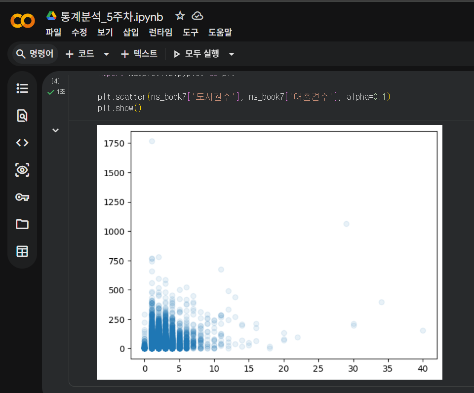
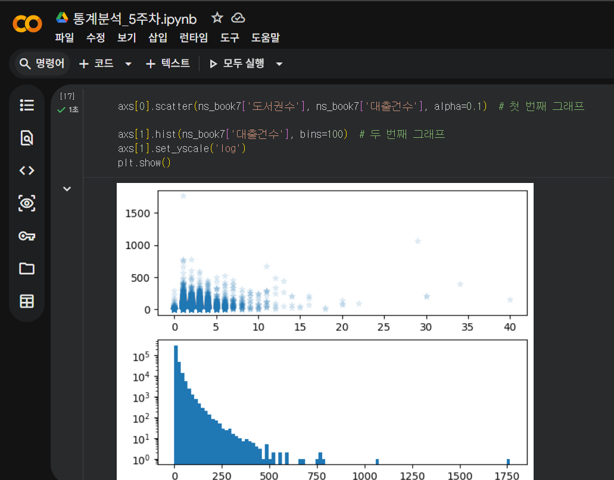
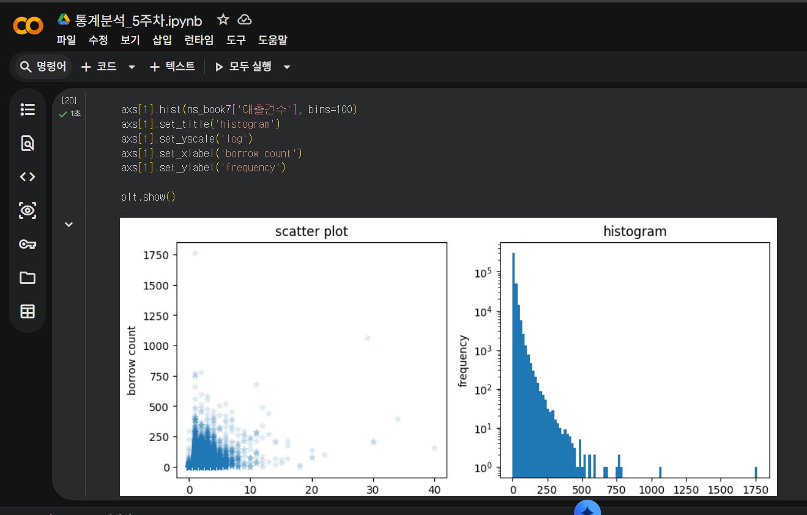
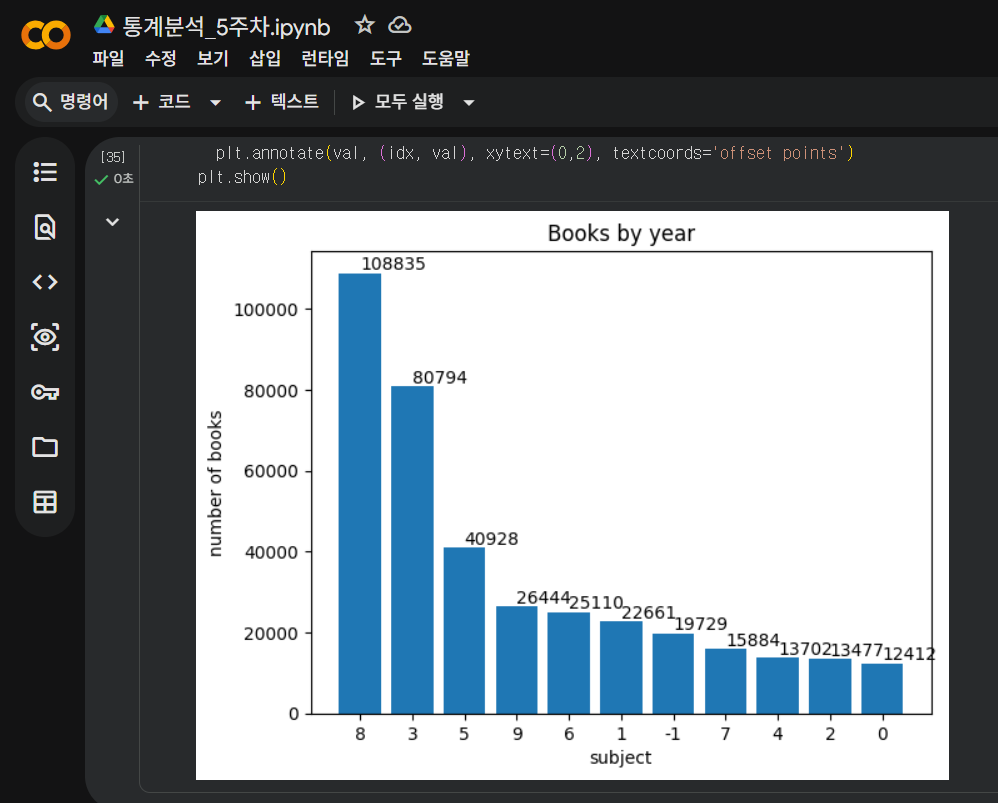
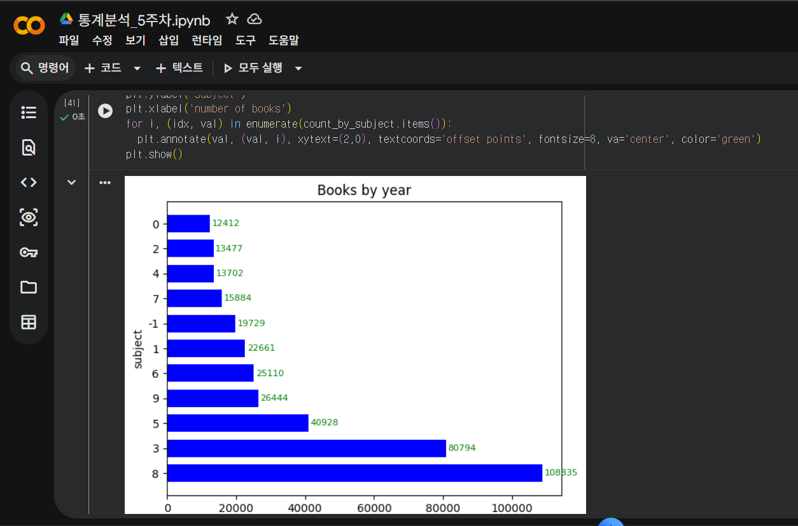

# 데이터분석 5주차 정규과제

📌데이터분석 정규과제는 매주 정해진 분량의 『*혼자 공부하는 데이터 분석 with 파이썬*』 을 읽고 학습하는 것입니다. 이번 주는 아래의 **DataAnalysis_5th_TIL**에 나열된 분량을 읽고 공부하시면 됩니다.

아래의 문제를 풀어보며 학습 내용을 점검하세요. 문제를 해결하는 과정에서 개념을 스스로 정리하고, 필요한 경우 제시된 강의를 참고하여 보완하는 것이 좋습니다.

<!-- 강의 링크는 아래와 같습니다.
https://www.youtube.com/watch?v=ho0LZ6GWhtc&list=PLVsNizTWUw7FGzSRCkQrPEEe-ljVXgS7k&index=10
https://www.youtube.com/watch?v=deYY4xHsI0o&list=PLVsNizTWUw7FGzSRCkQrPEEe-ljVXgS7k&index=11
-->


## DataAnalysis_5th_TIL

### 5장 데이터 시각화하기
#### 01. 맷플롯립 기본 요소 알아보기
#### 02. 선 그래프와 막대 그래프 그리기


## Study Schedule

| 주차  | 공부 범위     | 완료 여부 |
| ----- | ------------- | --------- |
| 1주차 | p.24~81    | ✅         |
| 2주차 | p.84~151   | ✅         |
| 3주차 | p.154~219  | ✅         |
| 4주차 | p.222~279 | ✅         |
| 5주차 | p.282~325 | ✅         |
| 6주차 | p.328~379 | 🍽️         |
| 7주차 | p.382~430 | 🍽️         |

<br>

<!-- 여기까진 그대로 둬 주세요-->


# 1️⃣ 개념 정리 

## 01. 맷플롯립 기본 요소 알아보기

### 1. Figure 객체

**01) Figure 란?**

- 모든 그래프의 구성 요소를 담고 있는 최상위 객체

**02) figsize 매개변수**

- 그래프 크기를 바꿀 수 있는 함수
- 기본 그래프 크기: (6, 4)

```python
plt.figure(figsize=(9,6))
plt.scatter(ns_book7['도서권수'], ns_book7['대출건수'], alpha=0.1)
plt.show()
```


**03) dpi 매개변수**

- 그래프 크기 바꾸기
- 기본값 72

```python
plt.figure(dpi=144)
plt.scatter(ns_book7['도서권수'], ns_book7['대출건수'], alpha=0.1)
plt.show()

# dpi 2배 >> 인치당 픽셀 수 2배 >> 그래프 크기 2배 >> 그래프 구성 요소(숫자, 마커 등)도 2배
```


### 2. rcParams 객체

**01) rcParams 란?**

- 맷플롯립 그래프의 기본값 관리 객체
- 객체 값 출력 및 변경


**02) DPI 기본값 바꾸기**

- 해상도 높이기 위해

```python
plt.rcParams['figure.dpi'] = 100
```


**03) 산점도 마커 모양 바꾸기**

- scatter.marker로 확인

```python
plt.rcParams['scatter.marker']  # 기본값 확인
plt.rcParams['scatter.marker'] = '*'  # 모양을 별로 변경
```

- 매번 기본값 수정 불필요 >> scatter()의 marker 매개변수 이용

```python
plt.scatter(ns_book7['도서권수'], ns_book7['대출건수'], alpha=0.1, marker='+')
plt.show()
```

### 3. 서브플롯 출력

- matplotlib의 Axes 클래스 객체
- 두 개 이상의 축 포함
- 각 축에는 눈금 or tick 표시
- 축의 이름 나타내는 레이블

**01) subplots() 함수**

```python
fig, axs = plt.subplots(2, 1) # 2개의 행, 1개의 열로 서브플롯 생성

axs[0].scatter(ns_book7['도서권수'], ns_book7['대출건수'], alpha=0.1)  # 첫 번째 그래프 

axs[1].hist(ns_book7['대출건수'], bins=100)  # 두 번째 그래프
axs[1].set_yscale('log')
plt.show()
```

- figsize 매개변수 사용 가능

```python
fig, axs = plt.subplots(2, figsize=(6,8)) 

axs[0].scatter(ns_book7['도서권수'], ns_book7['대출건수'], alpha=0.1)  # 첫 번째 그래프 
axs[0].set_title('scatter plot')

axs[1].hist(ns_book7['대출건수'], bins=100)  # 두 번째 그래프
axs[1].set_title('histogram')
axs[1].set_yscale('log')

plt.show()
```


**02) 서브플롯 가로로 출력**

- 일반적으로 (행, 열)
- 따라서 subplot(1, 2)와 같이 쓰면 가로로 그려짐
- 여기서는 set_xlable()과 set_ylable()도 진행

```python
fig, axs = plt.subplots(1, 2, figsize=(10,4)) 

axs[0].scatter(ns_book7['도서권수'], ns_book7['대출건수'], alpha=0.1)
axs[0].set_title('scatter plot')
axs[0].set_xlabel('number of books')
axs[0].set_ylabel('borrow count')

axs[1].hist(ns_book7['대출건수'], bins=100)
axs[1].set_title('histogram')
axs[1].set_yscale('log')
axs[1].set_xlabel('borrow count')
axs[1].set_ylabel('frequency')

plt.show()
```


### 📌 한바닥 정리

01) figure
- 맷플롯립의 그래프 요소를 모두 담고 있는 최상위 객체
- 맷플롯립으로 그래프 그릴 때 자동 생성 >> 그려진 후 자동 삭제

02) reParams
- 맷플롯립 그래프의 기본값 관리하는 객체
- 객체에 담긴 값 출력 및 새로운 값으로 교체

03) 축
- 그래프에서 데이터 좌표 표현
- 2차원 그래프는 축 2개, 3차원 그래프는 축 3개
- Axis, Axes(Axis 두 개 이상)

04) 마커
- 그래프에 데이터 포인트를 표시하는 방법
- 기본 마커 = 'o'
- rcParams 객체나 marker 매개변수로 바꿀 수 있음

05) 서브플롯
- 피겨 안에 포함된 그래프 영역
- 보통 Axes 객체
- subplots() 활용

06) 핵심 함수 & 메서드

| 함수/메서드 | 기능 |
| --- | --- |
| matplotlib.pyplot.figure() | 피겨 객체 만들어 반환 |
| matplotlib.pyplot.subplots() | 피겨와 서브플롯 생성하여 반환 |
| Axes.set_xscale() | 서브플롯의 X축 스케일 지정 |
| Axes.set_yscale() | 서브플롯의 y축 스케일 지정 |
| Axes.set_title() | 서브플롯의 제목 설정 |
| Axes.set_xlabel() | 서브플롯의 x축 이름 지정 |
| Axes.set_ylabel() | 서브플롯의 y축 이름 지정 |


## 02. 선 그래프와 막대 그래프 그리기


### 📌 연도별 발행 도서 개수 구하기


**01) value_count 메서드**

- 연도별 도서 개수 구하기

```python
count_by_year = ns_book7['발행년도'].value_counts()
count_by_year
```

**02) sort_index() 메서드**

- 오름차순 정리

```python
count_by_year = count_by_year.sort_index()
count_by_year
```

### 📌 주제별 도서 개수 구하기

**01) apply() 메서드**

- 데이터프레임에서 함수 반복 적용
- 여기서는 kdc_1st_char함수를 만들어 적용

```python
import numpy as np

def kdc_1st_char(no):
  if no is np.nan:
    return '-1'
  else:
    return no[0]

count_by_subject = ns_book7['주제분류번호'].apply(kdc_1st_char).value_counts()
count_by_subject
```


###  📌 선 그래프 그리기

**01) plot() 함수**

- 첫 매개변수에 x축 값, 두 번째 매개변수에 y축 값 할당

```python
plt.plot(count_by_year.index, count_by_year.values)
plt.title('Books by year')
plt.xlabel('year')
plt.ylabel('number of books')
plt.show()
```

**02) 선 모양과 색상 바꾸기**

(1) linestyle 매개변수

- 선 모양 지정 매개변수
<br>
- 실선: '-'
- 점선: ':'
- 쇄선: '-.'
- 파선: '--'

(2) color 매개변수

- 색상 지정
- 16진수(##ff0000) 컬러 코드 지정 or 색 이름(red) 지정

(3) marker 매개변수

- 산점도에서 활용

```python
from matplotlib.lines import lineStyles
plt.plot(count_by_year, marker='.', linestyle=':', color='red')
plt.title('Books by year')
plt.xlabel('year')
plt.ylabel('number of books')
plt.show()

# 마커, 선, 모양을 하나의 문자열로 지정 가능
plt.plot(count_by_year, '.:r')
```

**03) 선 그래프 눈금 개수 조절 & 마커에 텍스트 표시**

(1) xticks() 함수

- x축 눈금 지정
- 일정 기간 눈금 표시 위해 range() 함수 사용
- 시리즈 객체의 items() 메서드 >> 인텍스와 값을 감싼 튜플 얻을 수 있음
- 그래프에 값을 표시할 때는 annotate() 함수 사용
- 상대적인 위치를 포인프나 픽셀 단위로 지정 >> textcoords 매개변수 사용
    - 여기에서는 포인트 단위의 상대 위치 나타내는 'offset points' 지정

```python
plt.plot(count_by_year, '+-g')
plt.title('Books by year')
plt.xlabel('year')
plt.ylabel('number of books')
plt.xticks(range(1947, 2030, 10))
for idx, val in count_by_year[::5].items():
  plt.annotate(val, (idx, val))
plt.show()
```


### 📌 막대 그래프 그리기

**01) bar() 함수**

- plot()과 비슷 >> x축 값과 y축 값만 전달하면 됨
- 제목, 축 이름 등 표시 방법 같음

```python
plt.bar(count_by_subject.index, count_by_subject.values)
plt.title('Books by year')
plt.xlabel('subject')
plt.ylabel('number of books')
for idx, val in count_by_subject.items():
  plt.annotate(val, (idx, val), xytext=(0,2), textcoords='offset points')
plt.show()
```

**02) 텍스트 정렬, 막대 조절 및 색상 바꾸기**

- annotate() 함수의 매개변수
    - ha 매개변수: 텍스트 위치 조정. 'left', 'center', 'right' 제공.
    - fontsize 매개변수: 텍스트 크기 조정
    - color 매개변수: 텍스트 색 조정

- bar() 함수의 매개변수
    - width 매개변수: 막대 두께 조절. 기본값 0.8
    - color 매개변수: 막대 색깔 조정

```python
plt.bar(count_by_subject.index, count_by_subject.values, width=0.7, color='blue')
plt.title('Books by year')
plt.xlabel('subject')
plt.ylabel('number of books')
for idx, val in count_by_subject.items():
  plt.annotate(val, (idx, val), xytext=(0,2), textcoords='offset points', fontsize=8, ha='center', color='green')
plt.show()
```

**03) 가로 막대 그래프 그리기**

(1) barh() 함수
<br>
- 가로 막대 그래프 그려주는 함수
- 막대의 두께를 나타내는 매개변수는 width가 아니라 height
- x축과 y축의 이름을 바꿔야 함

```python
plt.bar(count_by_subject.index, count_by_subject.values, width=0.7, color='blue')
plt.title('Books by year')
plt.xlabel('subject')
plt.ylabel('number of books')
for idx, val in count_by_subject.items():
  plt.annotate(val, (idx, val), xytext=(0,2), textcoords='offset points', fontsize=8, ha='center', color='green')
plt.show()
```


### 📌 한바닥 정리

01) 선 그래프
- 각 데이터 포인트를 직선으로 연결한 그래프

02) 막대 그래프
- 데이터 포인트의 크기를 막대 높이로 나타낸 그래프
- x좌표는 범주형, y좌표는 해당 범주의 값

03) 핵심 함수와 메서드

| 함수/메서드 | 기능 |
| --- | --- |
| matplotlib.pyplot.plot() | 선 그래프 그리기 |
| matplotlib.pyplot.title() | 그래프 제목 설정 |
| matplotlib.pyplot.xlabel() | x축 이름 지정 |
| matplotlib.pyplot.ylabel() | y축 이름 지정 |
| matplotlib.pyplot.xticks() | x축 눈금 위치 & 레이블 지정 |
| matplotlib.pyplot.annotate() | 지정한 좌표에 텍스트 출력 |
| matplotlib.pyplot.bar() | 세로 막대 그래프 그리기 |
| matplotlib.pyplot.barh() | 가로 막대 그래프 그리기 |
| matplotlib.pyplot.imread() | 이미지 파일을 넘파일 배열로 읽기 |
| matplotlib.pyplot.imshow() | 이미지 출력 |
| matplotlib.pyplot.imsave() | 넘파이 배열을 이미지 파일로 저장 |
| matplotlib.pyplot.savefig() | 그래프를 이미지로 저장 |


# 2️⃣ 수행 인증








<br>
<br>

# 3️⃣ 확인 문제

## 문제 1.

> **🧚Q. 다음 데이터를 이용하여 matplotlib으로 선그래프를 그리는 코드를 작성해주세요.**
- x = [1, 2, 3, 4, 5]
- y = [2, 4, 6, 8, 10]
> 조건은 아래와 같습니다.
```
1️⃣ 제목은 "Linear Trend"로 설정해주세요.
2️⃣ x축 이름은 "X values"로 설정해주세요.
3️⃣ y축 이름은 "Y values"로 설정해주세요.
4️⃣ 마커(marker)를 포함하여 선그래프를 그려주세요.
```

```
import matplotlib.pyplot as plt

x = [1, 2, 3, 4, 5]
y = [2, 4, 6, 8, 10]

plt.plot(x, y, marker='o')
plt.title('Linear Trend')
plt.xlabel('X values')
plt.ylabel('Y values')

plt.show()
```


### 🎉 수고하셨습니다.