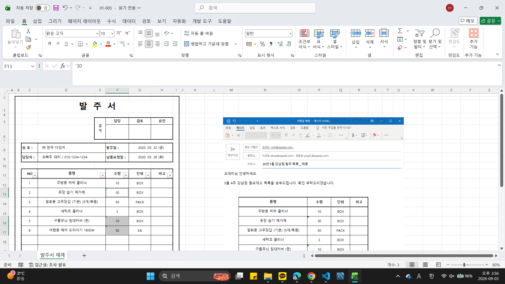

# Excel 1주차 정규 과제 

📌Excel 정규과제는 매주 정해진 분량의 『*진짜 쓰는 실무 엑셀*』 을 읽고 학습하는 것입니다. 이번주는 아래의 **EXCEL_1st_TIL**에 나열된 분량을 읽고 공부하시면 됩니다.

아래의 문제를 풀어보며 학습 내용을 점검하세요. 문제를 해결하는 과정에서 개념을 스스로 정리하고, 필요한 경우 제시된 강의를 참고하여 보완하는 것이 좋습니다.

**교재 실습 예제 파일은 1주차 과제 설명 노션에 있습니다. 해당 파일을 다운 후 실습 진행해주시면 됩니다.**

**👀(수행 인증샷은 필수입니다.)** 

## EXCEL_1st_TIL

### 1장 시작부터 남다른 실무자의 엑셀 활용
#### 01. 엑셀 기본 설정 변경으로 맞춤 환경 만들기 (범위 제외)
#### 02. 엑셀 좀 사용하려면 반드시 알아야 할 엑셀 기본키 (범위 제외)
#### 03. 엑셀의 기본 동작 원리 이해하기
#### 04. 엑셀에서 발생하는 모든 오류와 해결 방법 총정리
#### 05. 실무자면 꼭 알아야 할, 필수 단축키 모음

### 2장 실무자라면 반드시 알아야 할 엑셀 활용
#### 01. 보기 좋은 표, 활용할 수 있는 데이터를 위한 필수 상식
#### 02. 편리한 엑셀 문서 작업을 위한 실력 다지기
#### 03. 엑셀로 시작하는 기초 데이터 분석
#### 02. 엑셀 데이터 가공을 위한 텍스트 나누고 합치기

## Study Schedule

| 주차  | 공부 범위     | 완료 여부 |
| ----- | ------------- | --------- |
| 1주차 | p.22~111    | ✅         |
| 2주차 | p.112~157   | 🍽️         |
| 3주차 | p.158~213  | 🍽️         |
| 4주차 | p.214~273 | 🍽️         |
| 5주차 | p.274~339 | 🍽️         |
| 6주차 | p.340~425 | 🍽️         |
| 7주차 | p.426~472 | 🍽️         |

 

<!-- 여기까진 그대로 둬 주세요-->

---

# 1️⃣ 학습 내용 정리

## 01-3. 엑셀의 기본 동작 원리 이해하기
> **셀 참조 방식에 대해 정리해주세요.**

**✅ $ 기호: 행/열을 고정할 때 사용. 행과 열 모두 고정 또는 둘 중 하나만 고정 가능**

- **상대 참조**  
다른 셀을 참조할 때 셀 주소 앞에 $ 기호가 포되함지 않는 형식  
예시) =A1, =C5+D5

- **절대 참조**  
열(알파벳)과 행(숫자)에 모두 $ 기호 붙인 형태  
셀 주소 항상 고정  
예시) =$A$1

- **혼합 참조**  
행과 열 중 하나만 선택하여 고정하는 방식  
예시) =C$4*$B5

## 01-4. 엑셀에서 발생하는 모든 오류와 해결 방법 총정리
> **숫자처럼 보이는 문자를 빠르게 확인하고 해결하기(51 ~52p)를 진행 후 인증사진을 첨부해주세요.**

## 01-5. 실무자면 꼭 알아야 할, 필수 단축키 모음
> **이번에 배운 단축키에 대해 정리해주세요.**

**✅마법의 Alt 키**

1. Ctrl 키: 동시에 누르기
- Ctrl과 동시에 다른 키를 눌러 빠른 실행 가능
- 제한적인 기능에서만 사용 가능

2. Alt 키: 차례대로 누르기
- Alt 누른 다음 다른 키 눌러 다소 느림
- 리본 메뉴에서 제공되는 거의 모든 기능 단축키로 실행 가능
- Alt 누르면 리본 메뉴에 기능별 단축키가 표시되어 외우지 않아도 됨

**✅ 파일 관리 작업 처리 단축키**

1. Ctrl + S
- 파일 저장

2. Shift + F11
- 작업 중인 시트 왼쪽으로 새로운 시트 삽입

3. Ctrl + N
- 새로운 통합 문서 만들기
- 여러 개의 통합 문서가 열려 있는 상태 >> Ctrl + Tab >> 통합 문서 간 빠르게 이동 가능
- 여러 개의 통합 문서가 열려 있는 상태 >> Alt + Tab >> 실행 중인 모든 프로그램 목록 확인 후 이동 가능

4. Crtl + PageUp/PageDown, Ctrl + Shift + PageUp/PageDown
- 관리 중인 시트가 많을 때 이전/다음 시트로 빠르게 이동 가능
- 여러 시트 선택할 때는 Shift 사용하여 다중 선택 가능

5. Ctrl + 마우스 휠
- 화면 배율 조정
- 정확한 배율 조정은 엑설 화면 오른쪽 아래의 [확대/축소 비율] 버튼 활용

6. Alt >> P >> R >> S
- 인쇄 영역 설정
- 이후 Ctrl + p로 인쇄 미리보기 확인 필요

**✅ 편리한 작업을 위한 단축키**

1. Shift + F10
- 팝업 메뉴(마우스 우클릭 메뉴) 표시

2. Ctrl + F1
- 리본 메뉴 숨기기
- 다시 누르면 리본 메뉴 표시 가능

3. Ctrl + Shift + U
- 수식 입력줄 확장
- 수식 입력줄과 머리글의 경계를 드래그하여 조절 가능

4. Alt >> W >> F >> F
- 행/열 틀 고정

5. Ctrl + Shift + L
- 범위 정렬 또는 범위에서 원하는 값만 필터링할 때 자동 필터 적용
- Alt + ↓로 필터 옵션 활성화
- 이어서 E 누르면 바로 검색창으로 이동

6. Ctrl + \, Ctrl + Shift + \
- 기준 행/열 값과 다른 값 선택
- 좌우 비교, 상하 비교

7. Ctrl + [, Ctri + ]
- 수식에 사용된 셀/사용한 셀 한 번에 선택

**✅ 자료 편집 빠르게 하는 단축키**

1. Ctrl + A
- 연속된 범위 선택

2. Alt + Enter
- 셀 안에서 줄 바꿈

3. Ctrl + Alt + V
- 복사한 셀이나 범위를 원하는 형태로 붙여넣기 가능

4. Ctrl + Y
- 다시 실행

5. Ctrl + Enter
- 선택된 범위에 값을 한 번에 입력

6. Ctrl + D, Ctrl + R
- 선택된 범위의 첫 번째 셀 값으로 자동 채우기
- 아래 방향 자동 채우기. 오른쪽 방향 자동 채우기

7. Ctrl + E
- 빠른 채우기

**✅ 셀 서식 빠르게 변경 단축키**

1. Ctrl + 1
- 셀 서식 대화상자 열기

2. Alt >> H >> B >> A
- 선택된 범위 기본 테두리 적용
- Ctrl + Shift + 7: 바깥쪽에만 테두리 적용

3. 특정 서식 빠르게 적용

| 단축키 | 적용 서식 |
| :--- | :--- |
| Ctrl + Shift + ` | 일반 서식 (예: 1000) |
| Ctrl + Shift + 1 (!) | 숫자 서식 (예: 1000 → 1,000) |
| Ctrl + Shift + 2 (@) | 시간 서식 (예: 08:30, 09:15) |
| Ctrl + Shift + 3 (#) | 날짜 서식 (예: 2020-03-09) |
| Ctrl + Shift + 4 ($) | 통화 서식 (예: 1000 → ₩1,000) |
| Ctrl + Shift + 5 (%) | 백분율 서식 (예: 0.1 → 10%) |
| Ctrl + Shift + 6 (^) | 지수 서식 (예: 1000 → 1.00E+03) |

**✅ 셀 이동 및 선택이 빨라지는 단축키**

1. Ctrl + 방향키
- 범위의 마지막 셀로 이동

2. Ctrl + Shift + 방향키
- 표 끝까지 한 번에 선택

3. Ctrl + Backspace
- 현재 활성화된 셀 확인

4. Ctrl + Home/End
- 처음/마지막 셀로 이동

5. F5 또는 Ctrl + G
- 이동 대화상사 실행

6. Ctrl + Space, Shift + Space
- 행/열 전체 선택

7. Alt + ;
- 선택된 범위에서 보이는 데이터만 선택

8. Alt + Shift + →, Alt + Shift + ←
- 범위 그룹화 / 그룹 해제

9. Ctrl + 9, Ctrl + 0
- 행/열 숨기기

## 02-1. 보기 좋은 표, 활용할 수 있는 데이터를 위한 필수 상식
> **데이터와 표를 비교해주세요**
1. 표
- 사람이 보기에 편리하도록 시각화된 서식
- 시각화된 데이터의 한 종류

2. 데이터를 표로 관리하면 생기는 문제
- 데이터 정렬 또는 특정 값 찾을 때
- 새로운 데이터가 누적될 때
- 새로운 구분자를 추가할 때

> **셀 병합 기능을 자제해야 하는 이유를 정리해주세요.**
1. 주의할 점
- 셀 병합 기능을 사용하면 병합된 셀에서 첫 번째 셀 값만 인식됨

2. 문제점
- 범위 선택 제한
- 범위 수정/편집 제한
- 표 기능 및 피벗 테이블 사용 제한
- 자동 채우기 활용 불가
- 데이터 정렬 기능 사용 불가
- 함수 사용시 틀린 값 반환 가능

## 02-2. 편리한 엑셀 문서 작업을 위한 실력 다지기
> **셀 병합하지 않고 가운데 정렬하(75 ~77p)를 진행 후 인증사진을 첨부해주세요.**
<!-- 이 부분을 지우고 인증사진을 제출해주세요.-->

> **셀 병합 해제 후 빈칸 쉽게 체우기(78 ~79p)를 진행 후 인증사진을 첨부해주세요.**
<!-- 이 부분을 지우고 인증사진을 제출해주세요.-->

> **빈 셀을 한 번에 찾고 내용 입력하기(80 ~81p)를 진행 후 인증사진을 첨부해주세요.**
<!-- 이 부분을 지우고 인증사진을 제출해주세요.-->

> **숫자 데이터의 기본 단위를 한 번에 바꾸는 방법(84 ~87p)를 진행 후 인증사진을 첨부해주세요.**
<!-- 이 부분을 지우고 인증사진을 제출해주세요.-->

## 02-3. 엑셀로 시작하는 기초 데이터 분석
> **행/열 전환하여 새로운 관점으로 데이터 살펴보기(88 ~90p)를 진행 후 인증사진을 첨부해주세요.**
<!-- 이 부분을 지우고 인증사진을 제출해주세요.-->

> **중복된 데이터 입력 제한하기(90 ~92p)를 진행 후 인증사진을 첨부해주세요.**
<!-- 이 부분을 지우고 인증사진을 제출해주세요.-->

## 02-4. 엑셀 데이터 가공을 위한 텍스트 나누고 합치기
> **여러 줄을 한 줄로 합치거나 한 줄을 여러 줄로 분리하기(104 ~107p)를 진행 후 인증사진을 첨부해주세요.**
<!-- 이 부분을 지우고 인증사진을 제출해주세요.-->

> **여러 열에 입력된 내용을 간단하게 한 열로 합치기(108 ~109p)를 진행 후 인증사진을 첨부해주세요.**
<!-- 이 부분을 지우고 인증사진을 제출해주세요.-->

---

### 🎉 수고하셨습니다.

