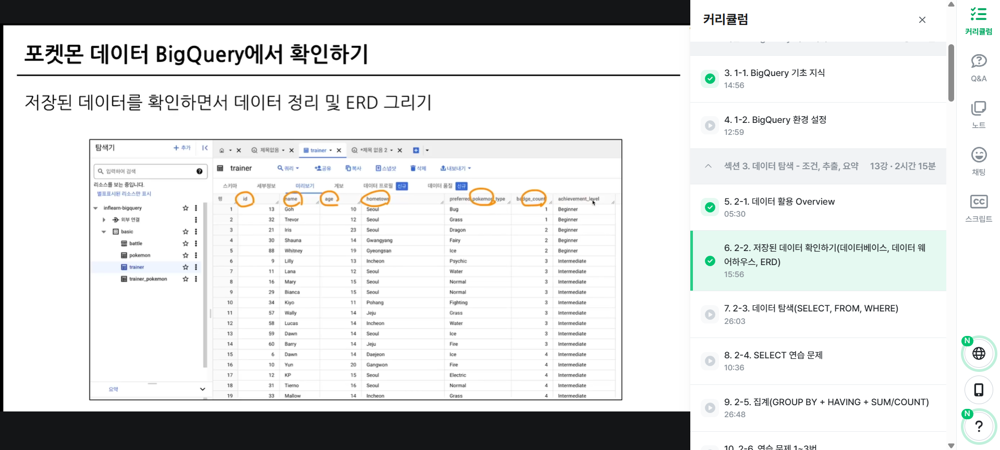

# SQL_BASIC 1주차 정규 과제 

📌SQL_BASIC 정규과제는 매주 정해진 분량의 `초보자를 위한 BigQuery(SQL) 입문` 강의를 듣고 간단한 문제를 풀면서 학습하는 것입니다. 이번주는 아래의 **SQL_Basic_1st_TIL**에 나열된 분량을 수강하고 `학습 목표`에 맞게 공부하시면 됩니다.

**👀(수행 인증샷은 필수입니다.)** 

## SQL_BASIC_1st_TIL

### 섹션 2. BigQuery 기초 지식

### 1-1. BigQuery 기초 지식

### 1-2. BigQuery 환경 설정

## 섹션 3. 데이터 탐색 - 조건, 추출, 요약

### 2-1. 데이터 활용 Overview 

### 2-2. 저장된 데이터 확인하기

## 🏁 강의 수강 (Study Schedule)

| 주차  | 공부 범위              | 완료 여부 |
| ----- | ---------------------- | --------- |
| 1주차 | 섹션 **1-1** ~ **2-2** | ✅         |
| 2주차 | 섹션 **2-3** ~ **2-5** | 🍽️         |
| 3주차 | 섹션 **2-6** ~ **3-3** | 🍽️         |
| 4주차 | 섹션 **3-4** ~ **4-4** | 🍽️         |
| 5주차 | 섹션 **4-4** ~ **4-9** | 🍽️         |
| 6주차 | 섹션 **5-1** ~ **5-7** | 🍽️         |
| 7주차 | 섹션 **6-1** ~ **6-6** | 🍽️         |

 

<!-- 여기까진 그대로 둬 주세요-->

---

# 1️⃣ 개념정리 
<!-- 강의 수강 이후에 아래의 학습 목표에 맞게 개념을 자유롭게 정리해주세요.-->
## 1-1. BigQuery 기본지식

~~~
✅ 학습 목표 :
* 데이터 관련 기초 지식(OLTP, SQL, Row, Column, 저장 형태 등)을 설명할 수 있다. 
* BigQuery 관련 기초 지식에 대해서 파악할 수 있다. 
~~~

### 📍데이터 저장 형태
 데이터는 데이터베이스 테이블 등에 저장
 - Database: 데이터의 저장소
 - Table: 데이터가 저장된 공간

### 📍OLTP
 Onlilne Transaction Precessing
 - MySQL, Oracle, PostgreSQL과 같은 데이터 베이스의 특징
 - 거래를 하기 위해 사용되는 데이터베이스
 - 보류, 중간 상태가 없음: 데이터가 무결
 - 데이터의 추가(insert), 변경(update) 발생 다수
 - 분석을 위한 데이터베이스가 아니기 때문에 쿼리 속도 느림

### 📍SQL
 "Structured Query Language"
 데이터베이스에서 데이터를 가지고 올 때 사용하는 언어
 (데이터베이스의 데이터를 관리하기 위해 설계된 특수 목적의 프로그래밍 언어)

### 📍테이블에 저장된 데이터 형태
 - Row: 행. 하나의 row가 하나아ㅢ 고유한 데이터
 - Column: 열. 각 데이터의 특정 속성 값
 - 엑설, 스프레드시트와 유사

### 📍OLAP
 Online Analytical Precessing
 - OLTP에 데이터 분석을 위한 기능을 넣은 것
 - 데이터 웨어하우스: 데이터를 한 곳에 모아서 저장

### 📍BigQuery
 **Google Cloud의 OLAP + Data Warehouse**
 - 장점: SQL을 사용해 쉽게 데이터 추출 가능
 - 속도: OLAP 도구이므로 속도가 빠름
 - Firevase, Google Analytics 4의 데이터 쉽게 추출 가능
 - 데이터 웨어하우스를 사용하기 때문에 서버(컴퓨터) 띄울 필요 없음

## 2-1. 데이터 활용 Overview

~~~
✅ 학습 목표 :
* 데이터를 활용하는 과정을 설명할 수 있다.
* 데이터를 탐색하는 과정으로 조건과 추출, 요약을 할 수 있다. 
~~~

### 📍데이터 활용 과정
 - 일 확인 (문제 정의, MECE해야 함)
 - 데이터 탐색
    - 단일 자료
    - 다량의 자료 > 연결
        - 조건
        - 추출
        - 변환
        - 요약
- 데이터 결과 검증
- 피드백 / 활용

> 데이터 탐색과 데이터 결과 검증에 SQL 활용

## 2-2. 저장된 데이터 활용하기

~~~
✅ 학습 목표 :
* 데이터가 저장되는 형태를 알고 저장된 데이터를 활용할 수 있다. 
~~~

### 📍데이터 저장 형태 확인
 - ERD(Entity Relationship Diagram): 데이터베이스 구조 한 눈에 알아보기 위해 사용
     - product > order > customer
 - ERD 없으면?
  - 테이블 확인
  - 컬럼 확인
  - 다른 테이블과 연결할 때 어떤 컬럼을 사용하는지 확인
  - 컬럼듸 값들이 어떤 의미를 가지는지 확인

### 📍 포켓몬 세상 데이터
 - 포켓몬
 - 트레이너
 - 트레이너가 잡은 포켓몬
 - 트레이너가 도전한 유저 배틀
 - 트레이너가 도전한 체육관 배출
 - NPC
 - 상점
 - 상점 내의 제품

### 📍이커머스 산업 데이터
 - 상품
 - 유저
 - 주문
 - 장바구니에 담은 물건
 - 웹페이지 접근 수

---
# 2️⃣ 학습 인증란

 
 

---

# 3️⃣ 확인문제

## 문제 1

> **🧚Q. 포켓몬 게임이나 이커머스 산업과 같이 다양한 산업에서는 각기 다른 데이터가 존재합니다. 다음 중 하나의 산업을 선택하고, 해당 산업에서 수집하고 활용될 수 있는 데이터 항목 (칼럼) 5가지를 자유롭게 상상하여 나열해보세요.**
>
> - 예시 산업 
>
> >  온라인 음식 배달 / 스마트 헬스 케어 / 중고 거래 앱 / 교육 플랫폼 등 

<!--현실과 데이터 분석의 연결 고리를 상상하고, 데이터를 저장하는 형태를 활용하는 문제입니다. -->

<!--학습한 개념을 활용하여 자유롭게 설명해 보세요. 구체적인 예시를 들어 설명하면 더욱 좋습니다.-->

~~~
 - 러시아/CIS 시장 타겟 이커머스

 통관 고유 부호 / 배송 시간 / 결제 수단 유형 / 반품 사유 코드 / 장바구니 체류 시간
~~~

## 문제 2

> **🧚Q. 이번 강의를 통해 SQL이 왜 필요하다고 느끼는지, SQL을 통해 본인이 어떤 것을 해내고 싶은지를 자유롭게 작성해보세요.**

~~~
 엑셀로 처리하기 힘든 대용량 데이터를 다룰 때, SQL을 활용하면 원하는 데이터를 빠르게 골라내어 분석할 수 있다는 것을 알게 되었습니다. 특히, 텍스트나 수치와 같은 데이터들이 흩어져있는 경우에 SQL이 데이터 분석에 큰 도움이 될 것이라고 생각합니다.

 또한, 저는 이런 SQL을 통해서 복합적인 데이터를 분석해보고 싶으며, 반복적인 작업을 SQL로 자동화하여 분석 효율성을 향상시키고 싶습니다.
~~~

### 🎉 수고하셨습니다.

