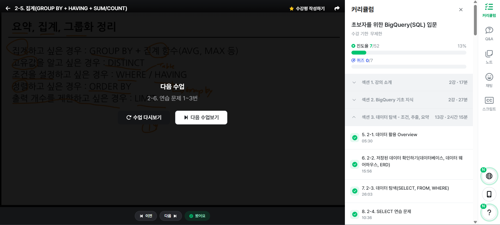

# SQL_BASIC 2주차 정규 과제 

📌SQL_BASIC 정규과제는 매주 정해진 분량의 `초보자를 위한 BigQuery(SQL) 입문` 강의를 듣고 간단한 문제를 풀면서 학습하는 것입니다. 이번주는 아래의 **SQL_Basic_2nd_TIL**에 나열된 분량을 수강하고 `학습 목표`에 맞게 공부하시면 됩니다.

**2주차 과제**는 1주차 과제처럼 SQL의 필요성이나 느낀점 위주가 아닌, **실제 강의 내용을 바탕으로 개념을 정리하고 학습한 내용을 집중적으로 기록**해주세요. 완성된 과제는 Github에 업로드하고, 링크를 스프레드시트 'SQL' 시트에 입력해 제출해주세요. 

**👀(수행 인증샷은 필수입니다.)** 

## SQL_BASIC_2nd

### 섹션 3. 데이터 탐색 - 조건, 추출, 요약

### 2-3. 데이터 탐색 (SELECT, FROM, WHERE)

### 2-4. SELECT 연습문제

### 2-5. 집계 (Group By + Having + Sum/Count)

## 🏁 강의 수강 (Study Schedule)

| 주차  | 공부 범위              | 완료 여부 |
| ----- | ---------------------- | --------- |
| 1주차 | 섹션 **1-1** ~ **2-2** | ✅         |
| 2주차 | 섹션 **2-3** ~ **2-5** | ✅         |
| 3주차 | 섹션 **2-6** ~ **3-3** | 🍽️         |
| 4주차 | 섹션 **3-4** ~ **4-4** | 🍽️         |
| 5주차 | 섹션 **4-4** ~ **4-9** | 🍽️         |
| 6주차 | 섹션 **5-1** ~ **5-7** | 🍽️         |
| 7주차 | 섹션 **6-1** ~ **6-6** | 🍽️         |

 

<!-- 여기까진 그대로 둬 주세요-->

---

# 1️⃣ 개념정리 

## 2-3. 데이터 탐색 (SELECT, FROM, WHERE)

~~~
✅ 학습 목표 :
* SQL 쿼리 구조를 이해할 수 있다. 
* SELECT, FROM, WHERE의 핵심 문법을 설명할 수 있다. 
~~~

### 📍SQL 쿼리 구조

- SELECT, FROM, WHERE
 
 **SELECT**  
    Col1 AS new_name,  
    Col2,  
    Col3  
 **FROM** Dataset.Table: 어떤 데이블에서 데이터를 확인할 것인가?  
 **where**: 원하는 조건이 있다면 어떤 조건인가?  
    Col1 = 1 :조건문

 - AS 별칭: 앞에 이름을 뒤와 같이 바꾸겠다
 - *: 모든 컬럼을 출력하겠다
    - SELECT * EXCEPT(제외할 컬럼) 형식으로 사용 가능

 - From '프로젝트 id.데이터셋.테이블'
    - 프로젝트 id는 꼭 명시할 필요는 없음
    - 하지만 프로젝트를 여러 개 사용한다면 명시하는 게 좋음
    - 프로젝트 is 없이 쓰면 작은따옴표 삭제 가능

 - 데이터 활용 목적이 있어야 어떤 컬럼을 사용할 것인지 결정 가능 

### 📍FROM, WHERE, SELECT

 1. FROM
 - 데이터를 확인할 Table 명시
 - 이름이 길면 AS 별칭으로 별칭 지정 가능
 - FROM table1 AS t1

 2. WHERE
 - FROM에 명시된 Table에 저장된 데이터 조건 설정
 
 3. SELECT
 - Table에 저장되어 있는 컬럼 선택
 - 여러 컬럼 명시 가능
 - col1 AS 별칭으로 컬럼의 이름도 별칭 지정 가능

## 2-5. 집계 (Group By / HAVING / SUM,COUNT)

~~~
✅ 학습 목표 :
* 데이터를 집계하고 그룹화하는 방법을 설명할 수 있다.
* GROUP BY, HAVING, ORDER BY, 집계함수(SUM/COUNT 등)을 활용하는 방법을 설명할 수 있다.
* having과 where의 차이에 대해서 설명할 수 있다.
~~~

**모아서 계산한다**

### 📍집계: GROUP BY
 - 모아서 그룹화
 - 특정 컬럼을 기준으로 모으면서 다른 컬럼에서는 집계 가능
 - '평균'과 '수' 집계하는 경우 多
 - ORDER BY로 정렬도 가능
 - 집계 후에 조건 설정은 HAVING 사용

 **SELECT**  
    집계할_컬럼1,  
    집계 함수(COUNT, MAX, MIN 등)  
 **FROM** Dataset.Table  
 **GROUP BY**  
    집계할_컬럼1

 - 집계할 컬럼을 SELECT에 명시하고, 그 컬럼을 꼭 GROUP BY에 작성해야 함

### 📍DISTINCT
 - 고유값을 알고 싶은 경우 (중복 제거)
 - COUNT(DISTINCT 컬럼)

 **SELECT**  
    집계할_컬럼1,  
    COUNT(DISTINCT 컬럼)  
 **FROM** Dataset.Table  
 **GROUP BY**  
    집계할_컬럼1

#### ✔️그룹화 활용 point
 - 일자별 집계
 - 연령대별 집계
 - 특정 타입별 집계
 - 앱 화면별 집계
 

### 📍WHERE vs HAVING

 | WHERE | HAVING |
 | --- | --- |
 | Table에 바로 조건 설정 | GROUP BY 후 조건 설정 |

### 📍서브 쿼리
 - SELECT 문 안에 존재하는 SELECT 쿼리
 - FROM 절에 또 다른 SELECT 문을 넣을 수 있음
 - 괄호로 묶어서 사용
  
 **서브 쿼리 작성 후 서브 쿼리 바깥에서 WHERE 설정 = 서브 쿼리에서 HAVING 설정**

### 📍정렬: ORDER BY
 - 맨 마지막에 작성
 - DESC (내림차순), OSC (오름차순 - Default)

### 📍출력 개수 제한: LIMIT
 - 맨 마지막에 작성
 - 쿼리문의 결과 Row 수 제한

# 2️⃣ 학습 인증란

  

---

# 3️⃣ 확인문제

## 문제 1

> **🧚Q. 포켓몬 마스터 진아는 포켓몬 데이터 조회하는 SQL문에 재미를 느껴서 혼자서 데이터를 조회하는 쿼리문을 짰습니다. 하지만 세 가지의 오류로 다음 코드가 실행이 안된다고 하는데, 각 오류의 위치와 이유를 설명하고, 올바른 쿼리문으로 수정해보세요.**

~~~sql
# 진아의 SQL Query문 
SELECT name. type
FROM pokemon;
WHERE type = Electric;
~~~

~~~
1. SELECT에서 필드 구분은 마침표가 아닌 쉼표를 사용해야 한다.
2. 중간에 세미콜론을 찍으로 쿼리가 중간에서 종료된다. 따라서 세미콜론을 지워야 한다.
3. Electric은 문자열이므로 세미콜론이 아니라 따옴표로 감싸서 표현해야 한다.

SELECT name, type
FROM pokemon
WHERE type = 'Electric'
~~~

## 문제 2

> **🧚Q. 앞서 SQL Query의 오류를 해결한 진아는 기분 좋게 이번에는 포켓몬 데이터에서 타입별 평균 공격력이 60 이상인 타입만 조회하려는 쿼리를 작성하려고 했습니다. 하지만 이번에도 실수를 하여 쿼리문이 실행되지 않거나 잘못된 결과가 나오고 있는데, 쿼리에서 잘못된 부분이 무엇인지 설명하고, 올바르게 수정한 쿼리를 작성해보세요.**

~~~sql
SELECT type, AVG(attack) AS avg_attack
FROM pokemon
WHERE AVG(attack) >= 60
GROUP BY type;
~~~

~~~
이미 집계한 데이터셋에 조검을 넣고 싶을 때는 WHERE 함수가 아닌 HAVING 함수를 사용해서 조건을 표현해야 한다.

SELECT type, AVG(attack) AS avg_attack
FROM pokemon
GROUP BY type
HAVING AVG(attack) >= 60;
~~~

### 🎉 수고하셨습니다.