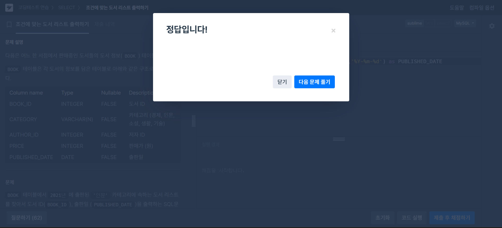

# SQL_BASIC 4주차 정규 과제 

📌SQL_BASIC 정규과제는 매주 정해진 분량의 `초보자를 위한 BigQuery(SQL) 입문` 강의를 듣고 간단한 문제를 풀면서 학습하는 것입니다. 이번주는 아래의 **SQL_Basic_4th_TIL**에 나열된 분량을 수강하고 `학습 목표`에 맞게 공부하시면 됩니다.

**4주차 과제부터는 강의 내용을 정리하는 것과 함께, 프로그래머스에서 제공하는 SQL 문제를 직접 풀어보는 실습도 병행합니다.** 강의에서는 **배운 내용을 정리하고 주요 쿼리 예제를 정리**하며, 프로그래머스 문제는 **직접 풀어본 뒤 풀이 과정과 결과, 배운 점을 함께 기록**해주세요. 완성된 과제는 Github에 업로드하고, 링크를 스프레드시트 'SQL' 시트에 입력해 제출해주세요.

**👀(수행 인증샷은 필수입니다.)** 

## SQL_BASIC_4th

### 섹션 4. 쿼리 잘 작성하기, 쿼리 작성 템플릿 및 오류를 잘 디버깅하기

### 3-4. 오류를 잘 디버깅하는 방법


## 섹션 5. 데이터 탐색 - 변환

### 4-1. INTRO

### 4-2. 데이터 타입과 데이터 변환(CAST, SAFE_CAST)

### 4-3. 문자열 함수(CONCAT, SPLIT, REPLACE, TRIM, UPPER)

### 4-4. 날짜 및 시간 데이터 이해하기(1) (타임존, UTC, Millisecond, TIMESTAMP/DATETIME)


## 🏁 강의 수강 (Study Schedule)

| 주차  | 공부 범위              | 완료 여부 |
| ----- | ---------------------- | --------- |
| 1주차 | 섹션 **1-1** ~ **2-2** | ✅         |
| 2주차 | 섹션 **2-3** ~ **2-5** | ✅         |
| 3주차 | 섹션 **2-6** ~ **3-3** | ✅         |
| 4주차 | 섹션 **3-4** ~ **4-4** | ✅         |
| 5주차 | 섹션 **4-4** ~ **4-9** | 🍽️         |
| 6주차 | 섹션 **5-1** ~ **5-7** | 🍽️         |
| 7주차 | 섹션 **6-1** ~ **6-6** | 🍽️         |

<br>

<!-- 여기까진 그대로 둬 주세요-->

---

# 1️⃣ 개념정리

## 3-4. 오류를 디버깅하는 방법

~~~
✅ 학습 목표 :
* 오류의 정의에 대해 설명할 수 있다. 
* 오류 메시지를 보고 디버깅이라는 과정을 수행할 수 있다. 
~~~

### 1. 오류의 정의

- 부정확하거나 잘못된 행동
- 오류 메세지가 알려주는 것
  - 현재 작성한 방식으로는 답을 얻을 수 없다 (길잡이 역할)
  - 이 부분이 문제가 있다 (문제 진단)


### 2. 대표적 오류

- Syntax Error (문법 오류)
  - 문법을 지키지 않아 생기는 오류
  - 에러 메시지 보고 번역 or 해석 이후 해결방법 모색
    - 구글
    - AI 엔진
    - 지인 or 커뮤니티 <br>
    에 물어보기

  1) SELECT list must not be empty at [:] <br>
    SELECT 목록은 비어있으면 안 된다 >> 컬럼이 있어야 하는데 비어있다

  2) Number of arguments does not match for aggregate function COUNT <br>
    집계 함수 COUNT의 인자 수가 일치하지 않습니다 >> COUNT 안에는 하나의 인자만!

  3) SELECT list expression references column 컬럼명 a which is neither grouped nor aggregated <br>
    SELECT 목록의 식은 다음에서 그룹화되거나 집계되지 않은 열을 참조합니다 >> GROUP BY에 적절한 컬럼을 명시하지 않았을 경우

  4) Expected end of input but got keyword SELECT <br>
    입력이 끝날 것으로 예상되었지만 SELECT 키워드가 입력되었다 >> (1) SELECT 근처 확인, (2) 하나의 쿼리에는 하나의 SELECT만 있어야 함, (3) 쿼리가 끝나는 부분에 ;을 붙이고 실행할 부분만 드래그 앤 드랍해서 실행해보기

  5) Expected end of input but got keyword WHERE at [:] <br>
    입력이 끝날 것으로 예상되었지만 [:]에서 키워드 WHERE을 얻었다 >> 쿼리에 WHERE이 잘 포함될 수 있도록 위치 조정

  6) Exoected ")" but got end of script at [;] <br>
    ")"가 예상되지만 [:]에서 스크립트가 끝났다 >> 괄호를 잘 작성했는지 확인


## 4-2. 데이터 타입과 데이터 변환(CAST, SAFE_CAST)

~~~
✅ 학습 목표 :
* 데이터 타입의 종류를 설명할 수 있다. 
* 데이터 타입을 변환하는 방법을 설명할 수 있다. 
~~~

### 1. 데이터 타입

- 숫자: 1, 2, 3, 3.5 등
- 문자: "따옴표", "안에", "있는", "것"
- 시간, 날짜: 2024-01-01, 2024-01-01 23:04:48 등
- 부울(Bool): True or False

1) 데이터 타입이 중요한 이유
  - 보이는 것과 저장된 것의 차이가 있기 때문
    - 엑셀에서 빈 값 >> 문자열일 수도 있고, NULL일 수도 있음
    - 1은 문자 or 숫자인지 모름


### 2. 자료 타입 변경하기

1) CAST: 자료 타입 변경

```sql
SELECT
  CAST(1 AS STRING) # 숫자 1을 문자 1로 변경
```
  - SAFE_CAST: 더 안전하게 데이터 타입 변경
  - SAFE_가 붙은 함수는 변환 실패시 **NULL** 반환

- 수학 함수 (수학 연산 존재)
  - 나누기를 할 경우 x/y 대신 SAFE_DIVIDE 함수 사용 >> x, y 중 하나라도 0이면 zero error 발생

 


## 4-3. 문자열 함수(CONCAT, SPLIT, REPLACE, TRIM, UPPER)

~~~
✅ 학습 목표 :
* 문자열 함수들의 종류를 이해하고 어떠한 상황에서 사용하는지 설명할 수 있다. 
~~~

### 1. 대표적인 연산

| 연산               | Input                  | Output                     | 함수 이름 |
|--------------------|------------------------|----------------------------|-----------|
| 문자열 붙이기      | "안녕" + "하세요"      | "안녕하세요"               | CONCAT    |
| 문자열 분리하기    | "가, 나, 다, 라"       | "가", "나", "다", "라"     | SPLIT     |
| 특정 단어 수정하기 | "안녕하세요"           | "실천하세요"               | REPLACE   |
| 문자열 자르기      | "안녕하세요"           | "안녕"                     | TRIM      |
| 영어 대문자 변환   | "ab"                  | "AB"                       | UPPER     |

1) CONCAT
  - 문법: CONCAT(컬럼1, 컬럼2, ...)

2) SPLIT
  - 문법: SPLIT(문자열 원본, 나눌 기준이 되는 문자)

3) REPLACE
  - 문법: REPLACE(문자열 원본, 찾을 단어, 바꿀 단어)

4) TRIM
  - 문법: TRIM(문자열 원본, 자를 단어)

5) UPPER
  - 문법: UPPEr(문자열 원본)


## 4-4. 날짜 및 시간 데이터 이해하기(1) (타임존, UTC, Millisecond, TIMESTAMP/DATETIME)

~~~
✅ 학습 목표 :
* 날짜 및 시간 데이터 타입과 UTC의 개념을 설명할 수 있다. 
* DATE, DATETIME, TIMESTAMP 에 대해서 설명할 수 있다.
* 시간함수들의 종류와 시간의 차이를 추출하는 방법을 설명할 수 있다. 
~~~

### 📌 핵심

1) 데이터 타입 파악: DATE, DATETIME, TIMESTAMP
2) 알면 좋을 내용: UTC, Millisecond
3) 타입 변환
4) 시간 함수 (두 시간의 차이, 특정 부분 추출 등)

### 1. 시간 데이터 다루기

- DATE: DATE만 표시. 2023-01-01
- DATETIME: DATE와 TIME 표시. 2023-01-01 14:00:00
- 타임존
  - GMT: Greenwich Mean Time
    - 그리니치 천문대를 기준으로 지역에 따른 시간 차이 조정
  - UTC: Universal Time Coordinated
    - 국제적인 표준 시간
  - TIMESTAMP
    - 시간 도장
    - UTC로부터 경과한 시간을 나타내는 값
    - Time Zone 정보 있음
    - 2023-01-01 14:00:00 UTC
- millisecond (ms)
  - 천 분의 1초
  - 빠른 반응이 필요한 분야에서 사용
  - Millisecond >> TIMESTAMP >> DATETIME으로 변경
- microsecond (us)
  - 백만 분의 1초

```sql
SELECT
  TIMESTAMP_MILLIS(1704176819711) AS milli_to_timestamp_value,
  TIMESTAMP_MICROS(1704176819711000) AS micro_to_timestamp_value,
  DATETIME(TIMESTAMP_MICROS(1704176819711000)) AS datetime_value,
  DATETIME(TIMESTAMP_MICROS(1704176819711000), "Asia/Seoul") AS datetime_value_asia;
-- "Asia/Seoul" 포함!!
```
- TIMESTAMP vs DATETIME

| 구분      | TIMESTAMP           | DATETIME                          |
|-----------|---------------------|-----------------------------------|
| 타임존    | UTC로 나옴          | T가 나옴 (TIME을 의미)            |
| 시간 차이 | 한국 시간 -9시간    | 한국 Zone 사용 시 한국 시간과 동일 |


<br>

<br>

---

# 2️⃣ 확인문제 & 문제 인증

## 프로그래머스 문제 

> 조건에 맞는 도서 리스트 출력하기
>
> **먼저 문제를 풀고 난 이후에 확인 문제를 확인해주세요**
>
> 문제 링크 
>
> :  https://school.programmers.co.kr/learn/courses/30/lessons/144853




## 문제 1

> **🧚Q. 프로그래머스 문제를 풀던 규서는 여러 번의 시행착오 끝에 결국 혼자 해결하기 어려워 오류 메시지를 공유하며 도움을 요청했습니다. 여러분들이 오류 메시지를 확인하고, 해당 SQL 쿼리에서 어떤 부분이 잘못되었는지 오류 메시지를 해석하고 찾아 설명해주세요.**

~~~sql
# 조건에 맞는 도서 리스트 출력하기
# 규서의 SQL 첫 번째 풀이
SELECT BOOK_ID, PUBLISHED_DATE
FROM BOOK
WHERE CATEGORY = '인문'
  AND YEAR(PUBLISHED_DATE, 2021);
  
오류 메시지 : Error: Number of arguments does not match for function YEAR
~~~


~~~
YEAR() 함수에 전달된 인자의 개수가 잘못되었다.
YEAR() 함수는 날짜 컬럼 하나만 받아서 해당 날짜의 연도만 추출하는 함수인데, 작성된 쿼리에서는 두 개의 인자를 넣었기 때문에 오류가 발생했다.
올바른 쿼리는 아래와 같이 작성해야 한다.

SELECT BOOK_ID, PUBLISHED_DATE
FROM BOOK
WHERE CATEGORY = '인문'
  AND YEAR(PUBLISHED_DATE) = 2021;
~~~


### 🎉 수고하셨습니다.