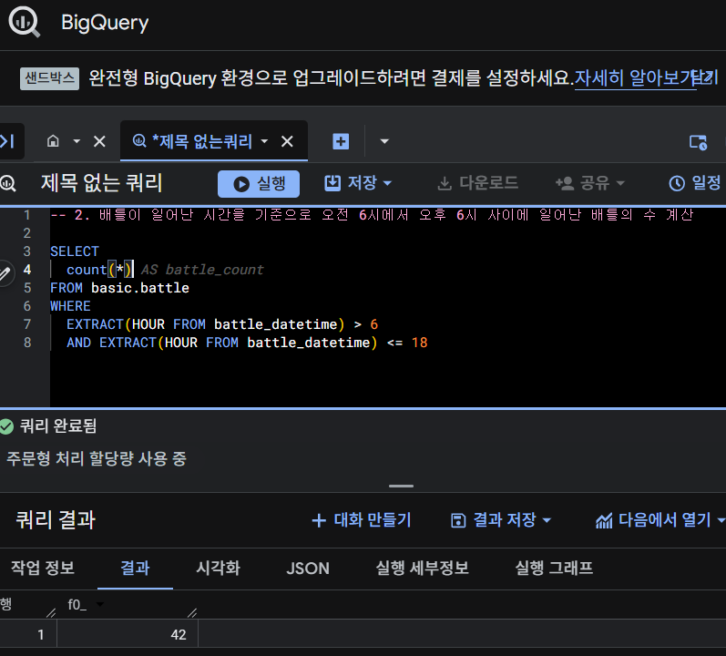
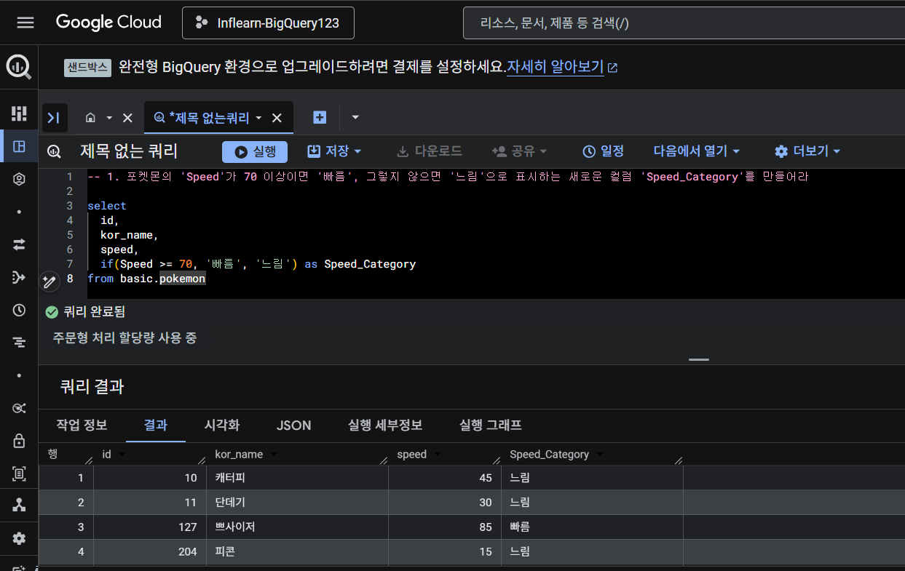
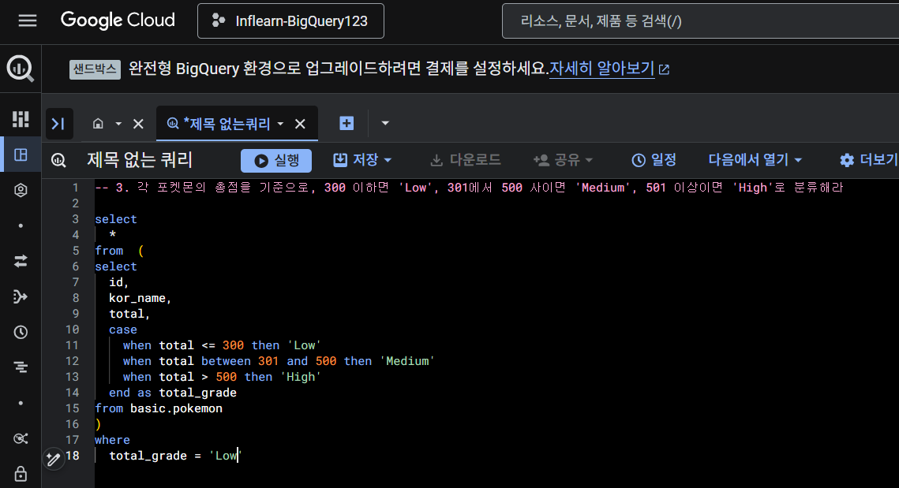

# SQL_BASIC 5주차 정규 과제 

📌SQL_BASIC 정규과제는 매주 정해진 분량의 `초보자를 위한 BigQuery(SQL) 입문` 강의를 듣고 간단한 문제를 풀면서 학습하는 것입니다. 이번주는 아래의 **SQL_Basic_5th_TIL**에 나열된 분량을 수강하고 `학습 목표`에 맞게 공부하시면 됩니다.

**5주차 과제는 문제 풀이를 중심으로**, 강의에서 제시된 예제 문제 중 **3 문제 이상을 선택하여 직접 풀어본 뒤**, 강의 영상의 풀이와 비교해 **틀린 부분, 맞은 부분, 새롭게 배운 개념**을 구체적으로 정리해주세요. (적어도 4문제는 정리해야 합니다.) 완성된 과제는 Gihub에 업로드하고, 링크를 스프레드시트 'SQL' 시트에 입력해 제출해주세요.

**👀(수행 인증샷은 필수입니다.)** 


## SQL_BASIC_5th

### 섹션 5. 데이터 탐색 - 변환

### 4-4. 날짜 및 시간 데이터 이해하기(2) (EXTRACT, DATETIME_TRUNC, PARSE_DATETIME, FROMAT_DATETIME)

### 4-5. 시간 데이터 연습문제 1~2번

### 4-5. 시간 데이터 연습문제 3~5번

### 4-6. 조건문 (CASE WHEN, IF)

### 4-7. 조건문 연습 문제

### 4-8. 정리

### 4-9. BigQuery 공식 문서 확인하는 법

(강의에서 연습문제가 많아서 따로 프로그래머스 문제 과제는 없습니다.)


## 🏁 강의 수강 (Study Schedule)

| 주차  | 공부 범위              | 완료 여부 |
| ----- | ---------------------- | --------- |
| 1주차 | 섹션 **1-1** ~ **2-2** | ✅         |
| 2주차 | 섹션 **2-3** ~ **2-5** | ✅         |
| 3주차 | 섹션 **2-6** ~ **3-3** | ✅         |
| 4주차 | 섹션 **3-4** ~ **4-4** | ✅         |
| 5주차 | 섹션 **4-4** ~ **4-9** | ✅         |
| 6주차 | 섹션 **5-1** ~ **5-7** | 🍽️         |
| 7주차 | 섹션 **6-1** ~ **6-6** | 🍽️         |

<br>


<!-- 여기까진 그대로 둬 주세요-->

---

# 4-4. 날짜 및 시간 데이터 이해하기(2) (EXTRACT, DATETIME_TRUNC, PARSE_DATETIME, FROMAT_DATETIME)

~~~
✅ 학습 목표 :
* 날짜 및 시간 데이터에 대해서 더 자세히 설명할 수 있다. 
* CURRENT_TIME, EXTRACT, DATETIME_TRUNC, PARSE_DATETIME, FROMAT_DATETIME 을 설명할 수 있다. 
~~~

## 📌 DATETIME 함수

### 1. CURRENT_DATETIME

```sql
CURRENT_DATETIME([time_zone])
-- 현재 DATETIME 출력
```

### 2. EXTRACT

- DATETIME에서 특정 부분만 추출하고 싶은 경우 사용

```sql
EXTRACT(part FROM datetime_expression)

-- 예시
EXTRACT(DATE FROM DATETIME '2024-02-02, 14:00:00') as date

-- 요일 추출
EXTRACT(DAYOFWEEK FROM datetime_col)
```

### 3. DATETIME_TRUNC

- 시간 자르기

```sql
-- DATE 와 HOUR만 남기고 싶은 경우
DATETIME_TRUNC(datetim_col, HOUR)
-- '2024-02-02, 14:34:50'을 HOUR로 자르면 '2024-02-02, 14:00:00'
```

### 4. PARSE_DATETIME

- 문자열로 저장된 DATETIME을 DATETIME 타입으로 바꾸고 싶은 경우

```sql
PARSE_DATETIME('문자열의 형태', 'DATETIME 문자열') AS datetime

-- 예시
PARSE_DATETIME('%Y-%m-%d %H:%M:%S', '2024-01-01 11:12:35') AS parse_datetime
```

### 4. FORMAT_DATETIME

- DATETIME 타입 데이터를 특정 형태의 문자열 데이터로 변환하고 싶은 경우

```sql
FORMAT_DATETIME('%c', DATETIME '2024-01-01 11:12:35') AS formatted
```

### 5. LAST_DAY

- 마지막 날을 알고 싶은 경우
- 자동으로 월의 마지막 값을 계산해서 특정 연산 진행

```sql
LAST_DAY(DATETIME)
-- 월의 마지막 값 반환

-- 예시
LAST_DAY(DATETIME '2024-01-01 11:12:35',MONTH) AS 이름_지정
LAST_DAY(DATETIME '2024-01-01 11:12:35',WEEK) AS 이름_지정
LAST_DAY(DATETIME '2024-01-01 11:12:35',week(SUNDAY)) AS 이름_지정
LAST_DAY(DATETIME '2024-01-01 11:12:35',week(MONDAY)) AS 이름_지정
```

### 6. DATETIME_DIFF

- 두 DATETIME의 차이를 알고 싶은 경우

```sql
DATETIME_DIFF(첫 DATETIME, 두 번째 DATETIME, 궁금한 차이)

-- 예시
DATETIME_DIFF(fitst_datetime, second_datetime, DAY)
```


# 4-6. 조건문(CASE WHEN, IF)

~~~
✅ 학습 목표 :
* 조건문 함수의 기능을 이해하고, 설명할 수 있다. 
~~~

## 📌 조건문이란?

- 특정 조건이 충족됐을 때, 아래 코드를 실행
- 특정 조건이 참일 때 A, 아니면 B
- 조건에 따라 다른 값을 표시하고 싶을 때 사용
- 함수
   - CASE WHEN
   - IF

## 📌 CASE WHEN

- 여러 조건이 있을 경우 사용
- 조건의 순서에 주의

```sql
SELECT
   CASE
      WHEN 조건1 THEN 조건1이 참일 경우 결과
      WHEN 조건1 THEN 조건1이 참일 경우 결과
      ELSE 그외 조건일 경우 결과
   END AS 새로운_컬럼_이름
FROM
WHERE
```

##  📌 IF

- 단일 조건일 때 유용

```sql
SELECT
   IF(조건문, True일 때의 값, False일 때의 값) AS 새로운_컬럼_이름
```


 # 4-5. 시간 데이터 연습문제 & 4-7. 조건문 연습 문제

~~~
✅ 학습 목표 :
* 4-5, 4-7 각각에서 두 문제 이상 (최소 4문제) 푼 내용 정리하기
~~~

## 4-5 문제 정리

### 1번
.png)
.png)

### 2번



## 4-7 문제 정리

### 1번


### 3번


<br>

<br>

---

# 확인문제

## 문제 1

> **🧚Q. 광윤이는 카페 주문 로그 데이터(order_log)를 분석하여, '오전(0시-11시)'과 '오후(12시-23시)'의 주문 건수를 집계하려고 합니다. 광윤이가 작성한 다음 SQL 쿼리 중 문법적으로 틀렸거나 의도한 결과가 나오지 않는 것을 모두 골라보세요. (복수 선택 가능)**

~~~sql
1. SELECT 
   IF(EXTRACT(HOUR FROM order_time) < 12, '오전', '오후') AS time_type,
   COUNT(*)
   FROM order_log
   GROUP BY time_type;

2. SELECT 
   DATETIME_TRUNC(order_time, HOUR) AS truncated_hour,
   COUNT(*)
   FROM order_log
   WHERE order_time BETWEEN '2021-01-01' AND '2021-12-31'
   GROUP BY order_time;

3. SELECT 
   FORMAT_DATETIME(order_time, '%H') AS order_hour,
   COUNT(*)
   FROM order_log
   GROUP BY 1;

4. SELECT 
    CASE 
      WHEN EXTRACT(HOUR FROM order_time) BETWEEN 0 AND 11 THEN '오전'
      ELSE '오후'
    AS time_group,
    COUNT(*)
   FROM order_log
   GROUP BY time_group;
~~~

<!-- 틀린쿼리에 대한 오류의 원인도 같이 작성해주세요. 문제에서 제공된 order_time 컬럼은 DATETIME type의 데이터를 가지고 있다고 가정합니다. -->

~~~
2번, 4번

2번: select에서 order_time이 truncated_hour로 전처리되었기 때문에 group by에서 order_time이 아니라 truncated_hour을 써야 한다.

4번: case when에 end가 없다. end as 변경할_이름 이런 구조가 필요하다.
~~~


## 문제 2

> **🧚Q. 예운이는 포켓몬 타입에 따라 설명을 부여하는 쿼리를 작성했습니다. type 1 컬럼의 값에 따라 조건을 분기했으며, 다음 SQL 쿼리를 실행했습니다.**

~~~sql
SELECT name,
       CASE 
         WHEN type1 = 'Fire' THEN 'Hot'
         WHEN type1 = 'Water' THEN 'Cool'
         ELSE 'Normal'
       END AS type_description
FROM pokemon;
~~~

> **다음 중 type_description의 결과가 'Normal'로 출력될 포켓몬은?**

| **name**   | **type1** |
| ---------- | --------- |
| Pikachu    | Electric  |
| Charmander | Fire      |
| Squirtle   | Water     |
| Bulbasaur  | Grass     |

<!-- 근거와 함께 답을 작성해주세요 -->

~~~
Pikachu, Bulbasaur이 Normal로 출력될 것이다.

Electric과 Grass는 조건에 없기 때문에 ELSE에 해당하기 때문이다.
~~~


<br>

### 🎉 수고하셨습니다.