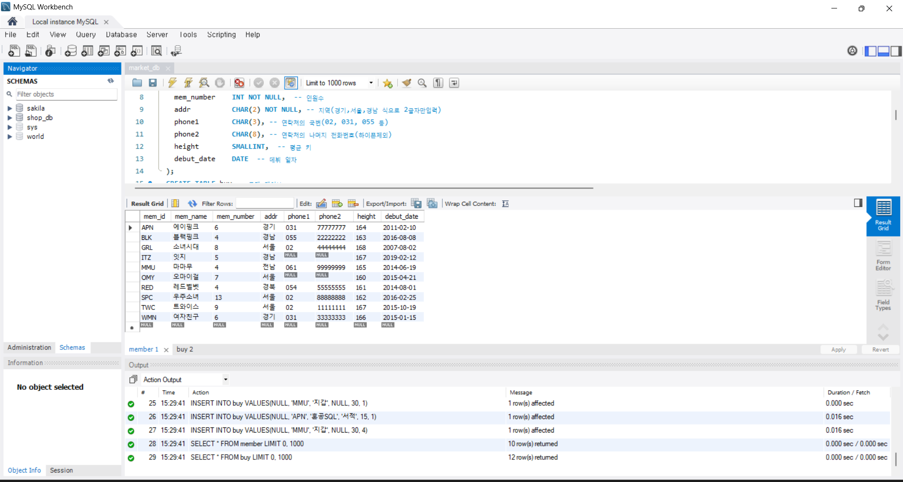
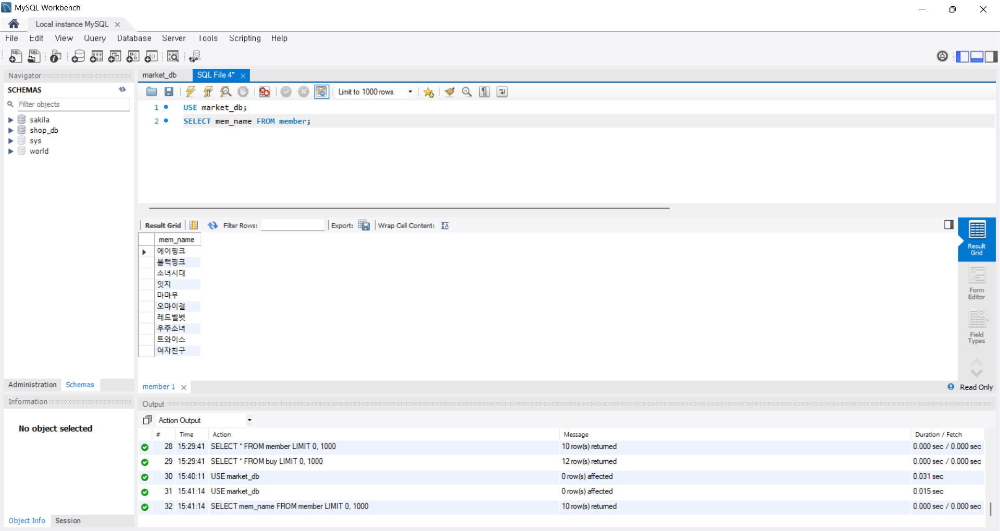
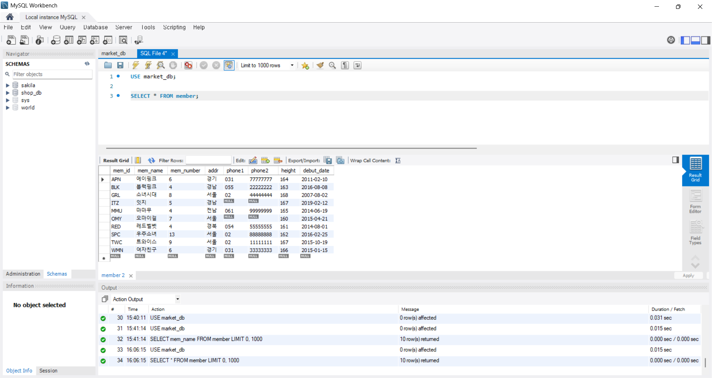
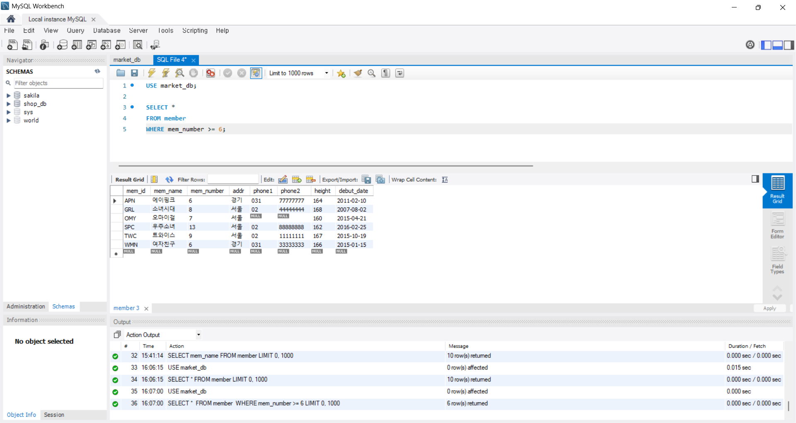
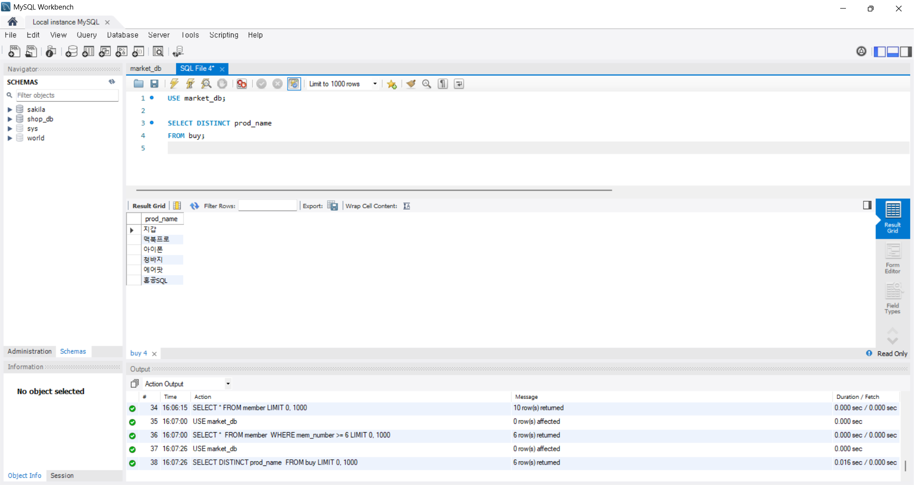
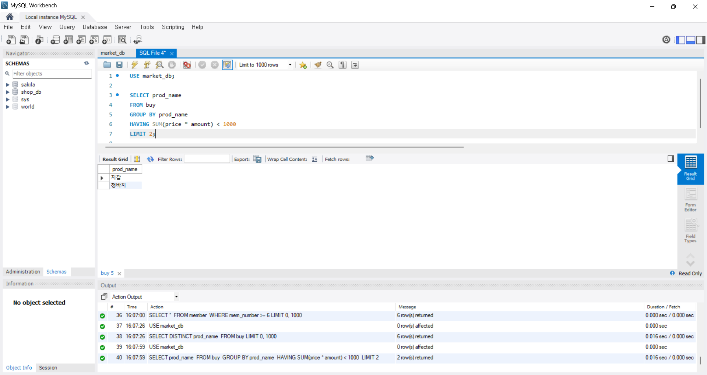

# SQL_ADVANCED 2주차 정규 과제 

📌SQL_ADVANCED 정규과제는 매주 정해진 분량의 『*혼자 공부하는 SQL*』 을 읽고 학습하는 것입니다. 이번주는 아래의 **SQL_ADVANCED_2nd_TIL**에 나열된 분량을 읽고 공부하시면 됩니다.

아래의 문제를 풀어보며 학습 내용을 점검하세요. 문제를 해결하는 과정에서 개념을 스스로 정리하고, 필요한 경우 제시된 강의를 참고하여 보완하는 것이 좋습니다.

<!-- 강의 링크는 아래와 같습니다.
https://www.youtube.com/watch?v=_JURyg_KzHE&list=PLVsNizTWUw7GCfy5RH27cQL5MeKYnl8Pm&index=7
https://www.youtube.com/watch?v=6qkPy7RfLqQ&list=PLVsNizTWUw7GCfy5RH27cQL5MeKYnl8Pm&index=8
https://www.youtube.com/watch?v=WWAFAm9op2U&list=PLVsNizTWUw7GCfy5RH27cQL5MeKYnl8Pm&index=9
-->

**교재 실습 예제 파일은 08_SQL_ADVANCED_Template 레포지토리의 src 폴더에 업로드되어 있습니다. market_db 파일도 해당 폴더에 함께 포함되어 있으니 참고하시기 바랍니다.**

**👀(수행 인증샷은 필수입니다.)** 

## SQL_ADVANCED_2nd_TIL

### 3장 SQL 기본 문법
#### 01. 기본 중에 기본 SELECT ~ FROM ~ WHERE
#### 02. 좀 더 깊게 알아보는 SELECT문
#### 03. 데이터 변경을 위한 SQL문


## Study Schedule

| 주차  | 공부 범위     | 완료 여부 |
| ----- | ------------- | --------- |
| 1주차 | p.24~99    | ✅         |
| 2주차 | p.102~155   | ✅         |
| 3주차 | p.158~213  | 🍽️         |
| 4주차 | p.216~271 | 🍽️         |
| 5주차 | p.274~327 | 🍽️         |
| 6주차 | p.330~369 | 🍽️         |
| 7주차 | p.372~407 | 🍽️         |


<br>

<!-- 여기까진 그대로 둬 주세요-->

---

# 1️⃣ 학습 내용 정리

## 1. 기본 중에 기본 SELECT ~ FROM ~ WHERE

### SELECT
- 열 이름이 나옴
- 조회하고 싶은 것 쓰면 됨
- 실행하기 위해 데이터 베이스 존재해야 함

### FROM
- 테이블 이름이 나옴
- 해당 테이블에서 내용을 가져온다는 의미

### WHERE
- 조건식이 나옴
- 관계연산자, 논리연산자 사용

### 서브쿼리
- `SELECT` 안에는 또 다른 `SELECT`가 들어갈 수 있음

### 컴퓨터 인식 순서
> FROM → WHERE → SELECT





> **확인문제: 주소의 지역이 서울, 경기인 회원을 추출하는 SQL 문입니다. 빈칸에 들어갈 수 있는 것을 모두 고르세요.**

```sql
SELECT *
FROM table
WHERE ________;
```

보기는 아래와 같습니다.
```
1. addr IN('서울', '경기')
2. addr BETWEEN '서울' AND '경기'
3. addr = '서울' OR addr = '경기'
4. addr = '서울' AND addr = '경기'
```

```
1번과 3번

IN 연산자는 괄호 안에 지정된 값들 중 하나라도 일치하는 데이터 추출
OR 연산자는 여러 조건 중 하나면 만족해도 추출
>> 따라서 둘 다 서울 또는 경기인 데이터를 추출함
```


## 2. 좀 더 깊게 알아보는 SELECT문

```
여기에 배우게 된 점을 적어주세요!
ORDER BY절: 결과의 정렬(오름차순 or 내림차순)
GROUP BY절: 지정한 열의 데이터들을 같은 데이터끼리 묶어서 결과 추출. 주로 집계 함수와 함께 사용됨.
HAVING절: GROUP BY절과 함께 사용되며 지정된 열의 조건식이라고 볼 수 있음
```

> **확인문제: 다음 표는 주요 집계함수를 정리한 것입니다. 각 설명에 해당하는 올바른 함수명을 기호에 맞게 작성하세요.**

| 함수명 | 설명 |
|--------|------|
| SUM() | 합계를 구합니다. |
| (ㄱ) | 평균을 구합니다. |
| (ㄴ) | 최소값을 구합니다. |
| MAX() | 최대값을 구합니다. |
| (ㄷ) | 행의 개수를 셉니다. |
| (ㄹ) | 행의 개수를 셉니다 (중복은 1개만 인정). |

```
여기에 답을 적어주세요!
(ㄱ) AVG()
(ㄴ) MIN()
(ㄷ) COUNT()
(ㄹ) COUNT(DISTINCT)
```


## 3. 데이터 변경을 위한 SQL문

<!-- INSERT문, UPDATE문, DELETE문에 관해 배우게 된 점을 적어주세요. -->

```
여기에 배우게 된 점을 적어주세요!
INSERT문: 테이블에 데이터를 삽입하는 명령어
- ex) INSERT INTO 테이블 [(열1, 열2, ...)] VALUES (값1, 값2, ...)

UPDATE문: 기존에 입력되어 있는 값 수정하는 명령어
- ex) UPDATE 테이블_이름
        SET 열1=값1, 열2=값2, ...
        WHERE 조건;

DELETE문: 행 단위로 데이터 삭제
- ex) DELECT FROM 테이블_이름 WHERE 조건;
```


# 2️⃣ 실습과제

다음 SQL 문을 작성하고 실행 결과를 확인 후 인증 사진을 아래에 업로드하세요.(market_db를 그대로 사용합니다.)

1. 모든 그룹 멤버의 정보를 조회하시오.
2. 멤버의 수가 6명 이상인 그룹 정보를 조회하시오.
3. 현재 구매 테이블에 존재하는 서로 다른 상품(prod_name)이 어떤 것이 있는지 조회하시오.
4. 총 구매 금액이 1000미만인 prod_name 중 상위 2개만 조회하시오.







### 🎉 수고하셨습니다.


